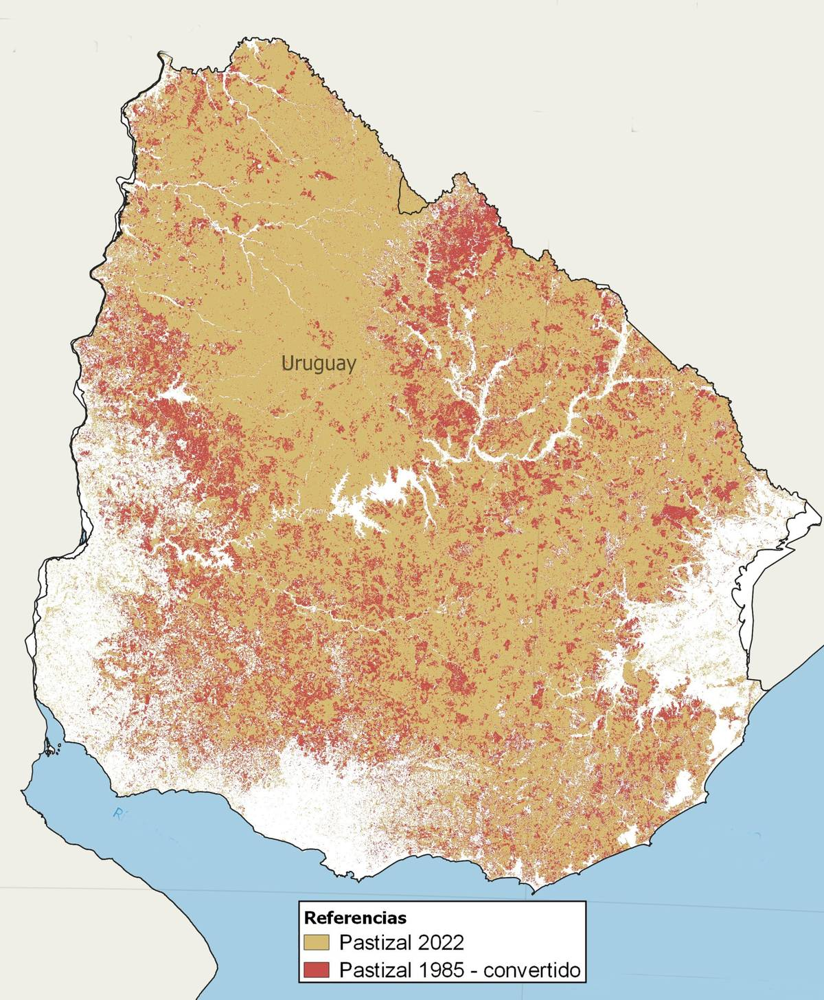

# Desarrollo temático

Para el desarrollo de este proyecto se parte del interés de la revalorización del papel _recuperado_ como material con una potencial reinserción en un nuevo ciclo de vida útil y para el desarrollo de productos. 

En un primer momento, la pregunta disparadora fue _«Dado el contexto actual en torno al papel, extracción de materia prima en Uruguay y su posterior producción y consumo, ¿sería posible reutilizar y recircular papel para el desarrollo de productos deseables, viables y factibles?»_ 

A partir de esa idea, se establecieron una serie de preguntas:
- ¿Se pueden desarrollar productos de papel reciclado que sean viables, deseables y de valor?¿Cuál sería su impacto?
- ¿Que tipo de papel se utilizará?¿Qué otros elementos incorporará?
- ¿Qué propiedades se desean lograr?
- ¿Qué procedimientos se utilizarán?
- ¿El material desarrollado en base a papel, será laminar, sólido, moldeable, mecanizable….?
-¿Qué uso se le podrá dar a ese material desarrollado en base a papel reciclado?

Habiendo planteado esas preguntas y en particular, enfocándose en el material (papel o pulpa de celulosa), se realizó una indagación bibliográfica sobre estos elementos en relación a Uruguay (Contexto local), desde una perspectiva productiva, social y ambiental. Estos fueron algunos de los resultados: 

- «Los estudios académicos advierten de una disminución del 50 por ciento de los caudales hídricos, cuando nuestras cuencas son forestadas y las investigaciones de empresas forestales reconocen que esa reducción llega al 30 por ciento»
[El impacto de la forestación en el déficit hídrico](https://brecha.com.uy/el-impacto-de-la-forestacion-en-el-deficit-hidrico/)

- «Desde 1990 la forestación aumentó en Uruguay más de 15.000 km2, reduciendo en 7,6% la superficie de pastizales.
[¿Logra regenerarse el pastizal, el ecosistema más amenazado de Uruguay, tras la forestación con pinos?](https://ladiaria.com.uy/ciencia/articulo/2023/2/logra-regenerarse-el-pastizal-el-ecosistema-mas-amenazado-de-uruguay-tras-la-forestacion-con-pinos/)

- La pulpa de celulosa podría convertirse este año en la principal exportación de Uruguay, por delante de la carne y soja; en 2023 eran el tercero.

- La producción de pulpa de celulosa tiene un impacto a nivel ambiental, a nivel de suelos y agua.

Estos hallazgos permiten visualizar que la producción de pasta de celulosa para la elaboración de papel presentan un gran número de implicancias a nivel productivo, económico y ambiental e implican distintas tensiones, pues se ponen en juego diferentes  aspectos que entran en tensión, como la generación de fuentes de trabajo, cambios en la matriz productiva, el cambio en el bioma natural de Uruguay y su sustentabilidad.

En ese sentido y, como se plantea en las el tablero incorporado en la sección [Ideas iniciales del Proyecto Integrador](https://pablocastro-s.github.io/pablo-castro/proyecto/Ideas%20iniciales/), mi interés inicial para el proyecto (el papel y su reciclaje como material) me llevó como potencial contexto de actuación (o al menos al cual enforcar mi proyecto) a la temática de los pastizales nativos y su valorización

## Acerca de los pastizales

### ¿Qué son los pastizales? 
Los pastizales son el ecosistema predominante de Uruguay. También llamados _campo natural_, este está conformado por gramíneas nativas, hierbas, arbustos y ocasionalmente árboles. Forman parte del denominado  Bioma Pampa, compartida con el sur de Brasil y parte de Argentina, que en 19 años tuvo una pérdida neta de vegetación nativa de 84.701 km². 
Los pastizales, además de ser fundamentales para el desarrollo de la ganadería extensiva —una de las principales actividades productivas del país— brindan diversos servicios ecosistemicos clave, como secuestro de carbón, controlar la erosión, proveer de agua de calidad, aportar a la biodiversidad, entre otros. 

Del Pino Machado et al sostienen que «Recientemente Uruguay ha atravesado un cambio profundo en el uso del suelo, caracterizado principalmente por un marcado aumento de la superficie forestada y agrícola a expensas de la superficie cubierta por comunidades de pastizal o campo natural (CN). Estos cambios tienen impactos ambientales sobre la provisión de bienes y servicios ecosistémicos que afectan la calidad de vida de la sociedad y la forma en que ésta percibe y valora los cambios en el uso de la tierra (Paruelo et al., 2006). Además de constituir el soporte de la ganadería extensiva en el Uruguay, el campo natural proporciona otra serie de servicios ecosistémicos: secuestro de carbono, control climático, regulación de inundaciones, beneficios culturales, entre otros (Altesor, 2011). (2021, p. 100) 

Alice Altesor (2014) afirma que el pastizal no solo ha sido clave para el desarrollo de la principal actividad económica históricamente (la ganaderìa). Además en el área de pastizales que comprenden Uruguay, Argentina y Brasil, el pastizal ha sido clave para el desarrollo de su identidad cultural, en particular la cultura *gauchesca*.
> «De tan presente que está, al pastizal nadie parece verlo. La percepción de la naturaleza no es la misma para todos los que la miran»
— Alice Altesor

### ¿A qué se debe ese decrecimiento del Pastizal? 

Esto se debe, en parte, a la expansión de la agricultura y la forestación. La forestación en nuestro país desde la década de los 90 ha sido impulsada a través de distintas políticas públicas que facilitan el desarrollo de la industria forestal, de donde se destaca la plantación de eucaliptus y pinos, árboles conocidos por su impacto negativo en el entorno donde son cultivados: empobrecen y acidifican los suelos, afectan a la vegetación nativa, fauna e insectos. Los suelos se ven afectados, pues además de acidificarse, pierden carbono y la capacidad de lograr intercambiar cationes de potasio y calcio.

Asimismo, la industria forestal tiene desde hace al menos dos décadas una nueva finalidad, o al menos línea de trabajo, en nuestro país: obtener materia prima para la industria de producción de pasta de celulosa ubicada en Uruguay, a través de tres plantas de origen extranjero que procesan la madera hasta obtener celulosa. Al día de hoy uruguay cuenta con las plantas Montes del Plata (ubicada en el departamento de Colonia), UPM 2 (en Paso de los Toros) y UPM 2 (Fray Bentos). 

El colectivo MapBiomas Uruguay sostiene que en nuestro país **se perdió 2,5 millones de hectáreas de pastizales naturales entre 1985 y 2022**.(...) En porcentaje, el análisis de las imágenes satelitales permite decir que **en 38 años nuestro país perdió 20% de sus pastizales naturales**. (Lagos, 2023) En concordancia con eso, el área para a cultivos y pasturas implantadas aumentó 42% y **la destinada a forestación 750%**. 

Pérdida de pastizal 1985-2022. Extraído de la diaria a partir de un mapa de MapBiomas Uruguay [Se puede consultar la versión interactiva desglosada](https://plataforma.uruguay.mapbiomas.org/).

A partir de lo anterior, se puede afirmar que, **el cambio productivo hacia un modelo extractivista orientado a la industria forestal potencia a la industria papelera (que de por sí tiene un amplio efecto negativo a nivel ambiental). Es por eso que lo que en un principio motivó al interés del proyecto: la materialidad del papel y su potencial como desecho, debería orientarse a un proyecto cuyo resultado aporte de cierta forma a la crítica del impacto ambiental de las industrias mencionadas y por otro, hacer visible y sensibilizar sobre la importancia del pastizal, el cual es importante pero carece de protección.**

### En resumen
Producto de la indagación realizada, y en vista del impacto ambiental y productivo que esas lógicas productivas tienen en el contexto local, se dió con hechos acerca de la producción de pulpa de papel y la producción forestal relacionada necesaria para este: ambas implican impacto negativo a nivel hídrico, de suelo, nutrientes y afecta (y conlleva) a la reducción del bioma de pastizales, que es el ecosistema predominante en Uruguay.
Para afrontar esta situación que perjudica a los pastizales es posible llevar a cabo dos tipos de estrategias: la conservación de los pastizales que no han sido afectados y la restauración de aquellos que sí lo han sido.
En ese marco, y alineado a las estrategias de conservación, para el proyecto se plantea contribuir al registro de los pastizales y a la concientización sobre su relevancia a través del desarrollo de un proyecto abierto que tiene como dispositivo de actuación a desarrollar una **cámara fotográfica estenopeica desarrolladas a partir de papel reciclado, que tienen como finalidad permitir el desarrollo de un registro fotográfico de los pastizales de Uruguay, para así sensibilizar sobre su relevancia y valor**.

## Referencias

Achkar, M. S., & Ortiz, M. (2023, febrero 17). El impacto de la forestación en el déficit hídrico. Semanario Brecha. https://brecha.com.uy/el-impacto-de-la-forestacion-en-el-deficit-hidrico/

Altesor, A. (2014). La vegetacion invisible. BSE. http://pastizales.fcien.edu.uy/libros-capitulos-revistas-difusion/

Campo Natural: El ecosistema de nuestro país. (s. f.). Recuperado 13 de diciembre de 2024, de https://www.fcien.edu.uy/noticias/231-noticias-ecologia/2535-campo-natural-el-ecosistema-de-nuestro-pais

Del Pino Machado, A., Lezama, F., Pezzani, F., & Parodi, G. (2021). Persistencia de efectos a largo plazo de la fertilización fosfatada y la introducción de leguminosas en pastizales del Uruguay. AgriScientia, 38(1), 99-109. https://doi.org/10.31047/1668.298x.v38.n1.26856

Lagos, L. (2022, junio 14). Pastizales, un ecosistema olvidado a la hora de hablar de conservación. la diaria. https://ladiaria.com.uy/ciencia/articulo/2022/6/pastizales-un-ecosistema-olvidado-a-la-hora-de-hablar-de-conservacion/

Lagos, L. (2023a, febrero 4). ¿Logra regenerarse el pastizal, el ecosistema más amenazado de Uruguay, tras la forestación con pinos? la diaria. https://ladiaria.com.uy/ciencia/articulo/2023/2/logra-regenerarse-el-pastizal-el-ecosistema-mas-amenazado-de-uruguay-tras-la-forestacion-con-pinos/

Lagos, L. (2023b, diciembre 7). Entre 1985 y 2022 Uruguay perdió 20% de sus pastizales naturales. la diaria. https://ladiaria.com.uy/articulo/2023/12/entre-1985-y-2022-uruguay-perdio-20-de-sus-pastizales-naturales/

Lagos, L. (2023c, diciembre 7). Entre 1985 y 2022 Uruguay perdió 20% de sus pastizales naturales. la diaria. https://ladiaria.com.uy/articulo/2023/12/entre-1985-y-2022-uruguay-perdio-20-de-sus-pastizales-naturales/
