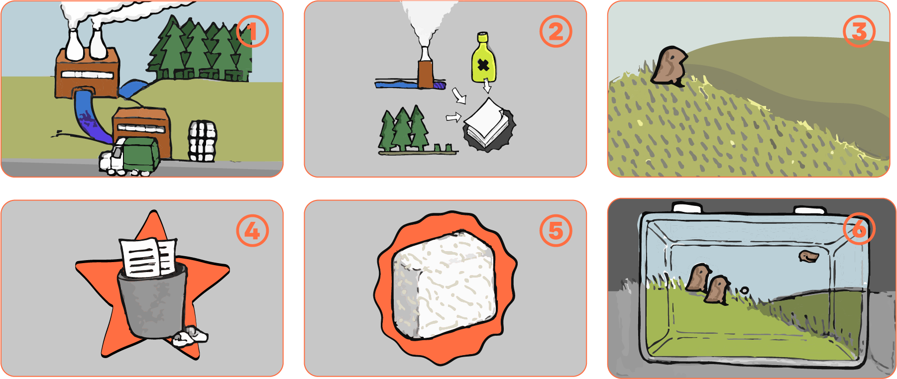
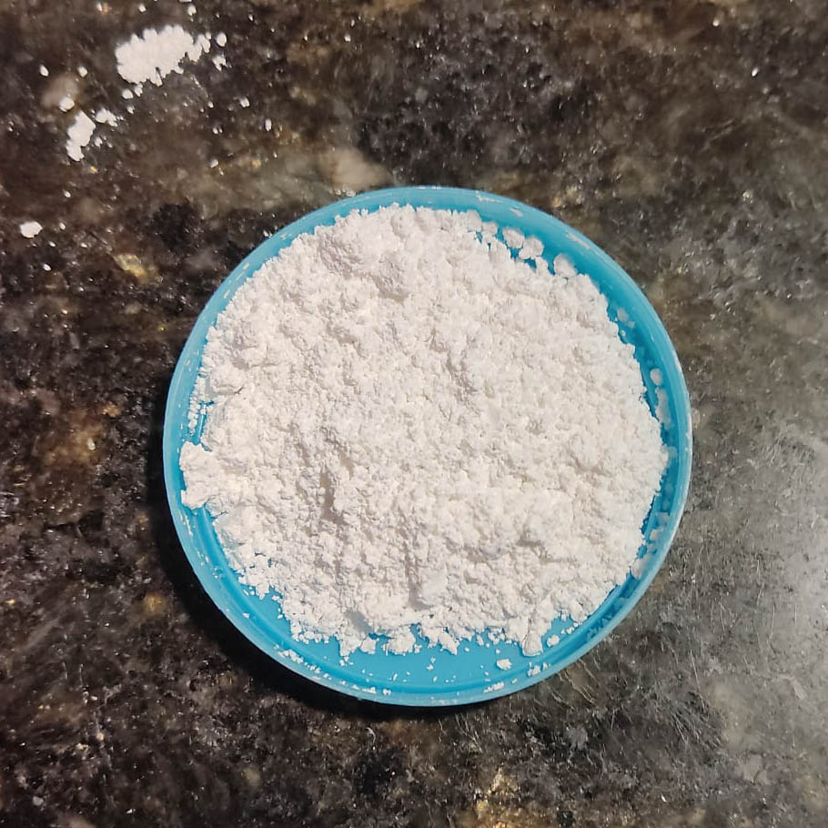
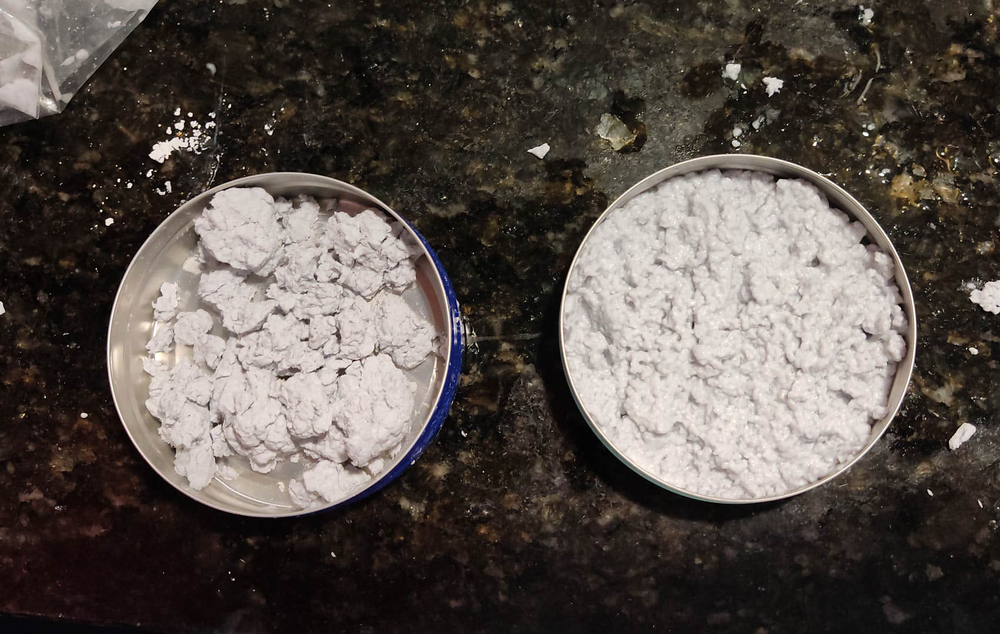
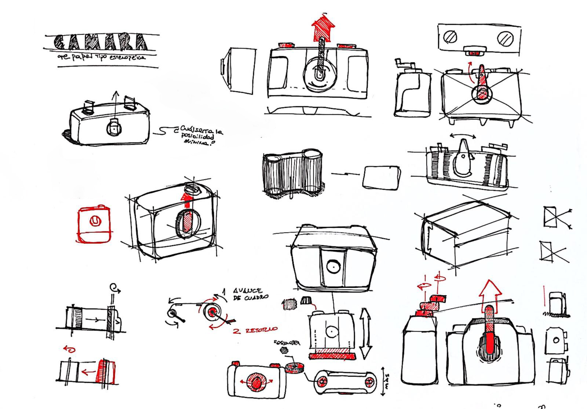
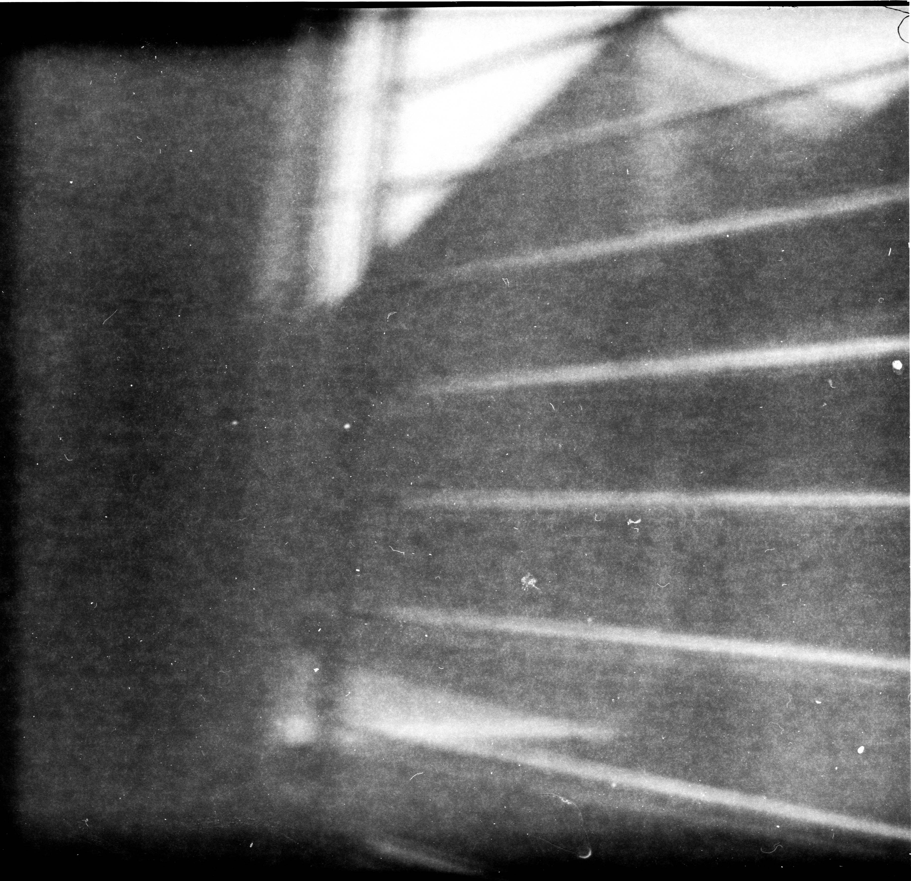

# Proyecto final integrador

## Presentación 
El dispositivo desarrollado es **Benteveo**, una cámara fotográfica analógica estenopeica cuya carcasa se encuentra elaborada a partir de papel reciclado, con la que se busca posibilitar la captura y el registro de distintas ubicaciones en donde esté presente el bioma del Pastizal. De esta forma se busca lograr un **low tech data sensing**, con una fuerte impronta visual, que aporte a sensibilizar sobre la importancia del bioma. 

El dispositivo busca insertarse en un potencial proyecto de colaboración y registro abierto, comunitario y distribuido/distribuible. Así, se pueden lograr fotografías analógicas que den cuenta de la realidad de los pastizales de Uruguay, en el marco de estrategias de conservación de los pastizales, dado que su existencia se vé amenazada por las industrias forestales y papeleras en Uruguay. De esta forma, se apunta a obtener datos en forma de imágenes visuales que, con su potencial artístico-expresivo sensibilicen y hagan visible nuestro principal bioma.  

La propuesta busca que sea abierta a actores interesados de la comunidad y fácilmente reproducible, por lo que al  estar basado en un modelo 3D paramétrico, es posible modificarlo o elaborar adaptaciones.  

Los interesados a involucrarse pueden ser ciudadanos involucrados, científicos, artistas, fotógrafos, makers, diseñadores, o cualquier persona del territorio nacional, que posea interés por la conservación, la sostenibilidad, la fotografía o curiosidad.

Si bien la complejidad del dispositivo puede inicialmente resultar alta, se pretende que de la mano de actores expertos se pueda acercar a las personas a su uso y realización, tanto en relación al dispositivo, como a la fotografía estenopeica. Asimismo, se plantea la distribución de dispositivos ya prontos para poder abarcar una mayor extensión del territorio nacional a *sensear* a través de la fotografía de los paisajes de los pastizales, su flora y fauna. 

A nivel de funcionamiento el dispositivo cuenta con un estenopo que es abierto al rotar su tapa, de esta forma se deja pasar luz que impacta sobre la película cargada en la cámara de 120mm. La duración de la apertura dependerá de la película utilizada, las condiciones lumínicas, entre otros factores. Una vez tomada la fotografía, manualmente se hace avanzar la película hasta el cuadro siguiente, tomando como referencia las guías que la película incorpora en su parte posterior, que puede ser observado por el visor de película ubicado en la parte posterior, dejando pronto el dispositivo para una posterior captura fotográfica.

 
## Desarrollo de la idea
Todo comenzó con la pregunta _¿Sería posible reutilizar y recircular papel para el desarrollo de productos deseables, viables y factibles?_, la cual parte de un interés personal por el material y por la influencia del contexto actual en torno al papel, extracción materia prima en Uruguay y su posterior producción, que permitió.

A partir de ahí se realizó un relevamiento de la temática, llegando a conocer el __impacto ambiental__ que tiene la producción de papel o pulpa de celulosa en Uruguay: Por un lado __se reemplaza el pastizal nativo por árboles destinados a la industria forestal__, que afectan el bioma nativo negativamente __eliminando en cantidad de superficie y reduciendo su calidad, así como afectando la calidad del ambiente__. Por otra parte, la industria de producción de celulosa que utiliza los árboles mencionados anteriormente para producir pulpa, tienen también su impacto ambiental, ya sea por el consumo de recursos, como por la gestión de químicos utilizados y su vertidos a flujos de agua . 

De esta forma, se llegó a conocer que la producción de papel o pulpa de celulosa tiene una gran repercusión sobre el tipo de bioma principal de Uruguay: el pastizal. Las lógicas productivas actuales lo reducen empobrecen, por lo que distintos expertos plantean la existencia de dos estrategias para su cuidado: la recuperación (de gran complejidad y escasa efectividad por el momento) y la **conservación**. 

A partir de esa noción, surgió la idea de poder desarrollar algún dispositivo destinado a obtener información para la aportar a conservación de los pastizales, pudiendo ser la medición o el registro de valores del entorno. Sin embargo, ante la existencia de equipamiento específico y profesional para ese fin, se optó por seguir otro camino: ¿que tal si se realiza una *captura* de los pastizales, pero desde una mirada más expresiva o visual, en pos de sensibilizar a la población sobre el pastizal, ese bioma característico que es invisible y va desapareciendo?. 

Así surgió la idea de desarrollar un dispositivo low tech de data sensing, donde los datos obtenidos sean de orden visual y abiertos: una cámara fotográfica estenopeica elaborada en papel.

Con la materialidad seleccionada, se busca poner en valor el material recuperado (que a su vez motivó la pregunta inicial), así como de cierta forma apuntar a, de cierta forma, _cerrar un círculo_ entre el origen de la materia prima y el impacto que ocasiona y su recuperación para el desarrollo de un dispositivo destinado a sensibilizar sobre los pastizales. 

Storyboard de la situación a trabajar y la idea a desarrollar

## Referencias y antecedentes
El proceso de diseño incorpora la experimentación e indagación de antecedentes en el desarrollo del material en base a papel, así como también en el desarrollo de cámaras estenopeicas y tecnologías similares. 

A nivel del material realizado en base a papel, se pueden descargar iniciativas como [Post Paper Studio](https://www.instagram.com/postpaperstudio/), el proyecto [Paper + Bioplastic de Eva Garibaldi](https://evagaribaldi.com/Paper-Bioplastic), mobiliario de papel de [Studio Woojai](https://katietreggiden.com/craft/studio-woojai-turns-waste-paper-into-bricks-and-furniture-circular-by-design-design-milk/), el [desarrollo de material en basea cartón reciclado y moldes impresos en 3D de XYZAidan](https://www.instructables.com/Recycle-Cardboard-Into-Anything-With-3D-Printing/), el [desarrollo de prototipos de packaging de pulpa de papel](https://www.youtube.com/watch?v=T0GGPoke4Kc&t=7s), el [trabajo de Debbie Wijskamp en base a pulpa de papel](https://www.debbiewijskamp.com/) y el [desarrollo de mobiliario en papel de Takeo](https://www.takeo.co.jp/en/design/006/). 

Por otra parte, existen diversos antecedentes a nivel de cámaras fotográficas estenopeicas, por lo general, desarrolladas bajo lógicas DIY y por comunidades de aficionados, que abarcan soluciones de diversos grados de complejidad. Es pertinente destacar a algunas desarrolladas en base a herramientas de fabricación digital, como es el caso de [Easy 35 3D Printed Pinhole Camera](https://www.instructables.com/Easy-35-3D-Printed-Pinhole-Camera/), [Modular Pinhole Camera de Nils Aksnes](https://www.35mmc.com/14/07/2021/developing-a-modular-pinhole-camera-by-nils-aksnes/), [Scura](https://doragoodman.com/goodlab-project/scura-pinhole-camera/), [terraPin](https://www.thingiverse.com/thing:495230). 

También es pertinente destacar la existencia de un caso de una cámara estenopeica, [Pinsta](https://www.pinstacamera.com/) desarrollada como producto comercial, que utiliza papel fotosensible y permite un revelado casi instantáneo, y  [la cámara de cartón Viddy](https://www.experimenta.es/noticias/industrial/viddy-camara-diy-carton/). 

##  **Benteveo**
El nombre del proyecto se debe al pájaro homónimo, que habita los pastizales de Uruguay y la región; es tomado como símbolo por su relevancia, así como por su similitud con los términos _bien te veo_, que se relaciona con una de las intenciones del proyecto: ver bien y detenidamente los pastizales fotografiados, para sensibilizar y revalorizar un bioma que se da por sentado.

La propuesta presentada incluye el diseño del dispositivo de captura **Benteveo** a nivel de prototipo, así como el sistema de moldes y prensas para materializar varios de sus componentes.

El diseño de **Benteveo** implicó seguir dos caminos en paralelo, aunque con varios puntos de contacto: uno para el desarrollo del **material basado en papel reciclado** y **desarrollo de la cámara estenopeica**.

### Material en base a papel
Como punto de partida para el desarrollo del material se partió por un análisis de antecedentes de materiales que tuvieran al papel reciclado o a la fibra de celulosa como base. Esto permitió establecer una serie de requisitos a la hora de idear y plantear posibles  capacidades para el material:

Indispensable
- Desarrollado mayoritariamente en base a papel reciclado
- No debe permitir el pasaje de luz
- Debe ser relativamente (en relación al uso) resistente
- Repetible
- Reutilizable para generar más material
- Simple

Deseable
- Ser mecanizable
- Fácilmente desmoldable
- Poder lograr un buen nivel de detalle

Optativo
- Potencial para incorporar color
- Almacenable para su uso posterior

A partir de esos requisitos delineados, se plantea el desarrollo de las distintas pruebas de material, llegando a desarrollar uno que es conformado por pulpa de papel (escurrida) obtenida de papel en desuso y carbonato cálcico en un ratio 5:1 respectivamente. El material resultante  también puede re utilizarse e incorporarse en la producción de más material, acompañado de los materiales mencionados anteriormente.

#### Exploracion 01
En este caso se parte de los fundamentos del reciclaje de papel para la elaboración de hojas de papel, para adaptarlo a un material volumétrico en lugar de laminar. Se opta por fraccionar en pequeños fragmentos y sumergirlos en agua por varios días para facilitar su procesamiento. Posteriormente, se procesan para obtener una pasta con la ayuda de un batidor de pintura montado en un taladro. De esta forma, se busca _romper_ las fibras del papel, pero resultando estas en un mayor tamaño respecto a otros métodos que utilizan cuchillas (por ejemplo, licuadoras o procesadoras) ya que esto le da una mayor resistencia, lo que es particularmente útil para hacer láminas de papel reciclado en forma de hojas. El material es secado al natural.

Como resultado de esta prueba se obtuvieron piezas sólidas conformadas únicamente con papel. Si bien resultan aparentemente resistentes, al no tener algún aditivo que contribuya a mejorar sus propiedades y características, solo basta hidratar la pieza para que pierda su conformación. Más allá de esto se comprueba que el material presenta plasticidad, en tanto mantiene las deformaciones producto de su manipulación cuando se encuentra hidratado.

#### Exploracion 02
Para la segunda exploración se opta por cambiar distintas variantes. En primer lugar, el método de procesado será a través de cuchillas, a través de una licuadora, en búsqueda de un resultado más homogéneo y uniforme, así como más fácilmente moldeable. Por otra parte, se evalúa su moldeado en distintos contenedores y, a diferencia de la exploración anterior, algunas muestras se mantendrán en el molde durante su secado. Finalmente, la mezcla desarrollada incorporará un aditivo a base de arroz para mejorar las propiedades mecánicas del material resultante.

Se comienza por el procesamiento manual del papel, fragmentándose en pequeños trozos que son hidratados por aproximadamente 24 horas, luego se procesan con una licuadora, donde se le agrega la pasta de arroz; de esta forma el adhesivo es incorporado a la pulpa de papel resultante. Antes de colocar el material resultante en moldes, se lo escurre utilizando un paño de tela como colador, para extraer gran parte de la cantidad de agua.

.jpg>) .jpg>) .jpg>) .jpg>)

El resultado obtenido son discos o prismas del material a base de papel con adhesivo de arroz a modo de aglutinante. Su apariencia es de una superficie levemente rugosa al tacto, capaz de copiar texturas o bajorrelieves y su color ondula entre el blanco y el gris claro.
Algo que se observa es que las piezas que fueron retiradas del molde antes de lograr un secado completo (o casi) presentan deformaciones. Este aspecto será relevante para considerar al momento de desarrollar el prototipo, pero se confirma en una siguiente exploración.

#### Exploracion 03
Se desarrolla una tercera exploración donde, bajo la recomendación surgida de las tutorías del Proyecto Final Integrador, se incorpora como material aglomerante o aditivo carbonato cálcico. Este material de origen natural, presente en rocas, en la estructuras de moluscos, corales o la cáscara de huevos, brindará al material en base de papel de una mayor resistencia que el adhesivo en base a arroz, lo que sería particularmente útil al momento de desmoldarlo.
Para esta exploración, se sigue un procedimiento similar que en la exploración anterior, pero sin el adhesivo de arroz e incorporando el carbonato cálcico. Con el fin de poder estimar las cantidades y sistematizar la elaboración de los materiales, se realizan pruebas con dos ratios de la relación entre la cantidad de pulpa de papel escurrida y el carbonato de calcio: uno 10:1 y otro 2:1 respectivamente. Asimismo, ambas permanecerán en el molde hasta haber secado prácticamente por completo; esto permite comprobar la idea de que el material sufre grandes deformaciones al secarse sin un molde y obtener un estimado de la contracción del material una vez seco.

Las muestras obtenidas tienen un color mucho más blanquecino que aquellas de la Exploración 2 y una textura más uniforme, tanto al tacto como a la vista. Se observa que de cada lado la contracción producto de la pérdida de agua en el secado es de aproximadamente 8mm. Luego de observar ambas muestras, se entiende conveniente ir por el camino de seguir un ratio papel - carbonato cálcico intermedio entre los dos utilizados. 

#### Conclusiones
A partir de las exploraciones materiales presentadas, se logra desarrollar un material a base de papel recuperado como elemento principal, denominado de ahora en más _papecal_, dado los materiales que lo componen. Este incorpora carbonato cálcico, en una relación 5:1 respecto a la cantidad de papel. La cantidad de agua se entiende como una variante no fija, es la necesaria para poder procesar el papel en la licuadora y para disolver de forma homogénea el carbonato de calcio; no afecta al resultado final de forma significativa —más allá de los tiempos de secado—pues es escurrida del material antes de ser moldeado y prensado.

### Desarrollo de la cámara estenopeica

Antes de avanzar conviene abordar la pregunta **¿Qué es una cámara estenopeica**. Se trata de de un tipo de cámara fotográfica que carece de lentes y en su lugar captura una imágen a través de un estenopo, que es un elemento con un orificio pequeño que permite el ingreso de luz para capturar la imágen en un medio fotosensible, bajo el principio de _camera obscura_.
La camera obscura es un fenómeno por el cual cuando los rayos de luz pasan por un orificio pequeño a un espacio oscuro se obtiene como resultado al dar con un plano una imagen invertida en el sentido vertical.

Para la conceptualización y planificación del dispositivo se realizó en primer lugar, y atendiendo a los elementos mínimos que la cámara debería contener, se comenzó por elaborar exploraciones conceptuales a nivel de boceto, al que posteriormente le siguió el modelado 3D en el software Fusion, en el cual se definieron distintos parámetros a medida que se modelaba la cámara en función de los componentes y dimensiones a alcanzar, lo que permite poder realizar ajustes o posteriores iteraciones de forma eficiente y sencilla.

Inicialmente se planteaba que la cámara estuviera desarrollada para ser utilizada con película de 35mm, sin embargo luego de recibir feedback e indagar más al respecto, se decidió que el formato a utilizar fuera 120mm, es decir formato medio. Esto permitiría lograr fotografías de mayor calidad y definición. Esta decisión llevó a repensar los «sistemas» que conformaría a la cámara en base al funcionamiento buscado, dada la lógica que este tipo de película conlleva: 

En primer lugar, se encuentra el estenopo. Este debe ser fijado a la cámara y tambièn permitir ser rápidamente cubierto y descubierto para lograr la captura de la imagen, al permitir el ingreso de luz a través del estenopo durante un tiempo determinado (a).

En segundo lugar, es necesario que la cámara pueda alojar dos carretes, uno con película nueva y uno vacío, que a medida que se van tomando fotografías y la película es avanzada por el usuario, recoge el film ya expuesto (b).

En tercer lugar se encuentra el mecanismo para hacer avanzar la película de forma manual (c).

Por otra parte, el film de 124 posee en su cara posterior indicadores numéricos del avance de la película, por este motivo la cámara dene incorporar en su cara posterior un visor para permitir llevar la cuenta de las fotografías tomadas (d).

Finalmente, el sistema que permite la apertura y el cierre del dispositivo para asegurar la cara posterior del dispositivo, permitiendo que sea removida para cambiar la película (e).

Sistemas del dispositivo

Dada la elección de la película, se opta por hacer que la cámara trabaje en el formato denominado **6x6**, con una relación de ratio 1:1, pues permite hacer un número relativamente alto de capturas (entre 12 y 13), así como también permite la captura de un área de forma equilibrada, dado que no hay una dimensión (alto o largo) que predomine en la fotografía a realizar.

La carcasa del dispositivo es elaborada a partir de un material conformado por papel recuperado y carbonato cálcico, denominado por razones de practicidad como _papecal_, que fue desarrollado luego de diversas iteraciones. Su apariencia rugosa y levemente irregular destaca a nivel visual y táctil. Esta es el elemento que posibilita que el fenomeno de la _camera obscura_ tenga lugar en el dispositivo.

####  Aspectos formales

A nivel formal, el dispositivo maneja un lenguaje similar al de las cámaras de formato medio tradicionales. Los elementos ornamentales se limitan a bajorrelieves en la cara frontal del dispositivo.
El exterior de la cámara presenta una apariencia de carácter prismático redondeado, que a priori parece ser rectangular, pero que por el contrario en sus distintas caras presentan conicidades (drafts) en relación a la cara frontal para facilitar su desmolde.
Los elementos que ofician de affordance de la cámara, impresos en PLA negro, son de caracter redondeado, sin aristas vivas, para aparentar una mayor suavidad y dotar al dispositivo de un caracter amigable.

 
#### Aspectos tecnológicos y materiales

El dispositivo está conformado por el material denominado como _papecal_ para las carcasas, y por PLA negro para los componentes internos y mecánicos. Estos elementos logran un CMF contrastante a nivel de color, textura y brillo. Los únicos elementos que no son de esos materiales son el estenopo, que es de aluminio recuperado de latas de bebidas, y los insumos (tornillos, tuercas e insertos roscados), que son de metal.

Una decisión relevante a la hora de proyectar el dispositivo fue la decisión de hacer que todos sus elementos sean desmontables, haciendo que no se utilicen adhesivos. De esta forma, se busca hacer que el producto sea reparable y sus componentes puedan ser reemplazados en caso de rotura y adecuadamente desmontables para una posterior recirculación. Es por este motivo, que se vale de uniones mecánicas removibles (tornillos y tuercas), uniones semifijas (este es el caso de los insumos mecánicos que son fijados a piezas de PLA con la utilización de calor, como es el caso de insertos roscados a la estructura interna o tornillos a _arandelas_ que facilitan su manipulación para el desenrosque ), piezas desmontables y uniones tipo snap-fit.

El diseño del dispositivo abarca tanto procesos aditivos, como sustractivos: tanto los componentes mecánicos y estructurales, como el molde para las piezas de _papecal_ son impresas en 3D mediante tecnologías FDM utilizando PLA (material escogido por su relativo bajo impacto ambiental, disponibilidad casi universal, resistencia acorde al funcionamiento previsto y bajo costo en comparación con otros filamentos), por otra parte el visor del número de la película (en acrílico) y la matriz que permite la elaboración del estenopo (en MDF) son fabricadas a través de corte láser.

Para las piezas impresas en PLA, dado que se vinculan por uniones con encastre o roscas, se utilizó unas tolerancias de 0.25mm. 

Los componentes elaborados a partir del material en base a papel recuperado, denominado _papecal_, son producidos mediante el moldeo del material en su estado húmedo. Los moldes desarrollados para este fin incluyen una conicidad de 2º en sus caras perpendiculares al fondo, formando parte de la morfología del dispositivo. De esta forma, se facilita el desmolde de las piezas. Asimismo, incorpora en el largo y espesor de las piezas un offset de 8mm que busca compensar la distancia que contrae el material luego de su secado. Dado que el tamaño máximo del área de impresión del la impresora 3D era de aproximadamente 23,5 cm tanto en ancho como largo y cerca de 24 en la altura, algunas de las piezas de los moldes fueron divididas para caber dentro de los límites. Por otra parte, se incorporaron drafts de 45º para evitar que las paredes laterales y la cara inferior deban incorporar soportes, reduciendo tiempos y costos de esta forma.

La matriz elaborada para permitir la elaboración del estenopo tiene como finalidad marcar la lámina de aluminio para poder obtener un _disco_ y poder realizar la perforación que permitirá el pasaje de luz de forma centrada, mediante el uso de un alfiler fino.
.jpg>)

### Prototipado

Para el desarrollo del prototipo, que tuvo lugar una vez definido el diseño del dispositivo y sus moldes y matrices, fue necesario producir la mayoría de las piezas, tanto las impresas como las moldeadas, siendo la única excepción los insumos utilizados para las uniones mecánicas, es decir tornillos, tuercas e insertos roscados. 

Para las piezas del molde y los componentes y mecanismos de funcionamiento de la cámara, se realizaron impresiones en 3D a partir del impresos en una impresora Creality Ender 3 S1 Pro con Grilon PLA 850 de color negro, el estenopo fue logrado a traves del «estampado», perforado y recorte de su forma en una lámina de aluminio recuperado, y la pieza correspondiente al visor de avance de la película es lograda en acrílico rojo mediante corte láser. En el caso de las piezas impresas, los parámetros para su impresión fueron las estándar ofrecidas por el slicer con soportes tipo árbol, y salvo en las piezas que extendían el tamaño de la cama de impresión, se imprimieron de forma perpendicular al sentido de la fuerza que recibirán.
Mientras tanto, aquellas cortadas por láser se desconocen los parámetros utilizados pues son los que consideró el proveedor.

.jpg>) .jpg>) .jpg>) .jpg>)

Una vez obtenidas las piezas correspondiente al molde, se procedió a ensamblarlo mediante la utilización de tornillo máquina de cabeza redonda tipo philips M8 y tuercas correspondientes a ellos, para así dar lugar a que se coloque en este la mezcla de _Papecal_, desarrollada según la receta presentada anteriormente. Algo a destacar es que para la fabricación de la pieza correspondiente a la tapa posterior del dispositivo se incorporó una prueba realizada con el material anteriormente, como parte de la mezcla de papel. De esta forma, se comprueba que el material puede ser fácilmente recirculado para generar nuevas piezas.

El modelo fue realizado colocando el material en el molde, asegurándose que en zonas con rebajes a obtener en la pieza hubiera material y luego prensándolo con la pieza correspondiente al interior, donde quedaría la pieza principal para secar. El prensado de la pieza fue logrado, sin embargo no se pudo llegar a la profundidad deseada, pues no se contaba con algún tipo de prensa que auxiliara en esta tarea. Asimismo, al recibir fuerza en el sentido de las paredes del molde de forma lateral, la pieza inferior, correspondiente al frente de la cámara comenzó a separarse, dado que la recibió en el sentido de las capas. A pesar de esto, se pudo lograr la pieza deseada, aunque sin tanta precisión en los rebajes _estéticos_ de la cámara, con bordes desprolijos en el canto y con un mayor espesor que el deseado en esa zona. El interior de la carcasa principal mantuvo las dimensiones deseadas, dado que al secar la pieza en un _contramolde_, la contracción producto del secado tuvo lugar en las dimensiones exteriores de la pieza, como fue planificado. 

.jpg>)
.jpg>)
.jpg>)
-2.jpg>).jpg>)
.jpg>)
.jpg>)
.jpg>)
.jpg>)
.jpg>) .jpg>)
.jpg>) .jpg>) .jpg>) .jpg>) .jpg>) .jpg>) .jpg>)
.jpg>)

Por otra parte, para fabricar el estenopo, una vez armada la prensa, se procedió a colocar un recorte de aluminio obtenido de una lata de refresco y se comenzó a fijar en el lugar por medio de tornillos máquina cabeza redonda M3. Una vez fijada en el lugar, con la ayuda de un martillo, se presiona para que tome la forma de un rebaje cilíndrico, que luego es perforado con un alfiler, lijado y recortado.

<iframe width="560" height="315" src="https://www.youtube.com/embed/aZ1s-FwnVqs?si=qwSNSv7GVBnhqT9e" title="YouTube video player" frameborder="0" allow="accelerometer; autoplay; clipboard-write; encrypted-media; gyroscope; picture-in-picture; web-share" referrerpolicy="strict-origin-when-cross-origin" allowfullscreen></iframe>

.jpg>) .jpg>) .jpg>)

Para el armado del dispositivo se procedió a colocar los insertos roscados en la pieza correspondiente al soporte interior de la cámara, colocándolos con un soldador de estaño que lo calienta y por conducción ablanda el PLA en la zona a colocarlo y con una leve presión es colocada en la ranura correspondiente. Asimismo, se sigue este procedimiento con dos tornillos allen cabeza cilindrica de acero negro M5 x 0.8, de 30mm de largo, que reciben en sus cabeza dos piezas impresas de PLA que permitiran fijar la tapa posterior a la estructura interna de la cámara. 

Posteriormente se posiciona el estenopo de aluminio dentro de las piezas que lo fijan en su lugar mediante una rosca y una arandela que lo presiona y fija en su lugar de forma recta.

Luego se coloca la pieza de la estructura en la carcasa de la cámara y se hace coincidir a las perforaciones de las caras inferiores y superiores con las ranuras de la carcasa, que encastran sin necesidad de insumos. Luego se enroscan los elementos de fijación de los carretes y la arandela, palanca y el elemento de sujeción de este, que configuran el subsistema de avance de la película.

.jpg>) .jpg>) .jpg>) .jpg>) .jpg>) .jpg>)
-1.jpg>)

La pieza de acrílico rojo, correspondiente al visor del avance de la película se coloca en la pieza destinada a ese fin, al que luego se le agrega la pestaña que permite cubrir el visor o descubrirlo. El conjunto resultante es colocado en la ranura de la tapa posterior y fijado con la arandela destinada a ese fin.

La estructura de la tapa es fijada a la tapa con tornillos y tuercas M3 y se hacen dos perforaciones pasantes para las piezas conformadas por los tornillos allen cabeza cilindrica de acero negro M5. Una vez hecho esto, la cámara puede ser cerrada.

## Testeo del dispositivo
A modo de testeo del funcionamiento del dispositivo se procedió a tomar un rollo de fotografías que, si bien no serían de los pastizales.

Como resultado de eso, se obtienen una serie de fotografías, de las cuales solo 2 de 12 son «visibles». Del resto solamente se puede, en el mejor de los casos, intentar adivinar la fotografía.

Este resultado puede deberse a veladuras —producto del contacto del rollo con luz, ya sea dentro o al querer sacarlo de la cámara— como también, según el profesional encargado del revelado, de una mala tanda de rollos de la marca Ilford modelo delta 100 que produce artefactos no deseados en las fotografías tomadas. 

De igual forma, se puede concluir que el estenopo y la cámara funcionan, aunque debe seguirse experimentando para saber si se trata de un error de diseño, de uso del dispositivo o una tanda de rollos defectuosa.

 

## Conclusiones y pasos a seguir

Como punto de partida conviene retomar la pregunta que sirvió de disparador para este proyecto: _Dado el contexto actual en torno al papel, extracción de materia prima en Uruguay y su posterior producción y consumo, ¿sería posible reutilizar y recircular papel para el desarrollo de productos deseables, viables y factibles?_. Habiendo atravesado el presente proyecto final integrador se entiende que se puede aventurar a responder _Es posible que sí_. 

Sin embargo, el proyecto fue derivando en algo más que el desarrollo de un producto en particular para su comercialización; la pregunta disparadora desembocó en un abordaje centrado en las distintas implicancias e impactos que tiene la producción de papel en Uruguay. Por ese motivo es que se desarrolló  **Benteveo** , dispositivo que está conformado por papel, cuya materialidad apunta, en conjunto a su funcionalidad, a sensibilizar sobre el impacto de la industria papelera y forestal, así como evitar que sea naturalizada la forma en que afectan a los pastizales de Uruguay.

Además, para llevar adelante el cometido que el proyecto propone sería necesario vincular el dispositivo con individuos o agrupaciones que propicien el resultado buscado: capturar los pastizales locales mediante fotografías estenopeicas. Para esto sería necesario contar con varias cámaras para ser entregadas o desarrollar talleres para que se elaboren y luego en salidas de campo registrar mediante ese _low tech data sensing_ y posteriormente difundir o exponer el resultado. 

Asimismo, **Benteveo** nace proyectado bajo el paradigma de diseño abierto, por lo que al hacer público los archivos, se da lugar a la generación de reproducciones, mejoras e iteraciones por parte de terceros, lo que se ve facilitado por la incorporación de modelado paramétrico. De esta forma se busca facilitar la distribución del dispositivo, en tanto se brindan los medios para replicarlo. Sin embargo, para que esto sea más accesible sería necesario a futuro generar material explicativo y de referencia, para así lograr un acercamiento más amigable para los usuarios.

Sobre los aspectos tecnológicos del proyecto se concluye que el material desarrollado en base a papel recuperado presenta potencial para seguir siendo investigado y experimentado, tanto en relación a este proyecto, así como otros potenciales usos y cualidades expresivas, como por ejemplo la integración de color. Por otra parte, se observa que se subestimó la fuerza que recibirán los moldes, lo que tuvo un impacto directo en la rotura de aquellas piezas impresas de forma vertical para lograr caber dentro de las dimensiones de la impresora utilizada, ya que recibieron fuerza en el sentido de las capas impresas. 
Una posible solución a esto radica en dividir las piezas para luego imprimirlas en el sentido perpendicular a la fuerza que recibirán, así como reducir el tamaño de la pieza.
Continuando en esa dirección, se cree que sería beneficioso en una posterior iteración del dispositivo trabajar en su simplificación, reduciendo la cantidad y complejidad de los componentes, para así potenciar su replicabilidad y ser más eficiente en los recursos utilizados.

Un aspecto a continuar del proyecto, que por razones de tiempo no se pudo implementar, es la realización de salidas de campo a pastizales locales para comenzar con el registro fotográfico de estos. El testeo realizado de la cámara dio resultados promisorios, aunque es necesario continuar experimentando en el uso del dispositivo. 

Otro elemento que se podría incorporar al proyecto es el uso de sensores que permitan tomar una foto del suelo en paralelo a la fotografía del pastizal, para lograr mapear el estado y calidad de suelo de los pastizales, mediante la vinculación con sensores NPK, que miden sus niveles de nitrógeno, potasio y fósforo, aspectos clave para determinar su calidad. Esta información, tanto visual (fotografía) como numérica (datos obtenidos del suelo) podrían luego ser volcadas en una plataforma digital para permitir el acceso y difusión.

A nivel personal, creo que el proyecto fue igualmente desafiante e interesante, y presenta un gran potencial para ser continuado, así como la necesidad de ser abierto a distintos actores e individuos de la sociedad.

