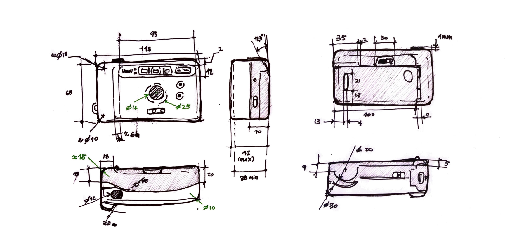
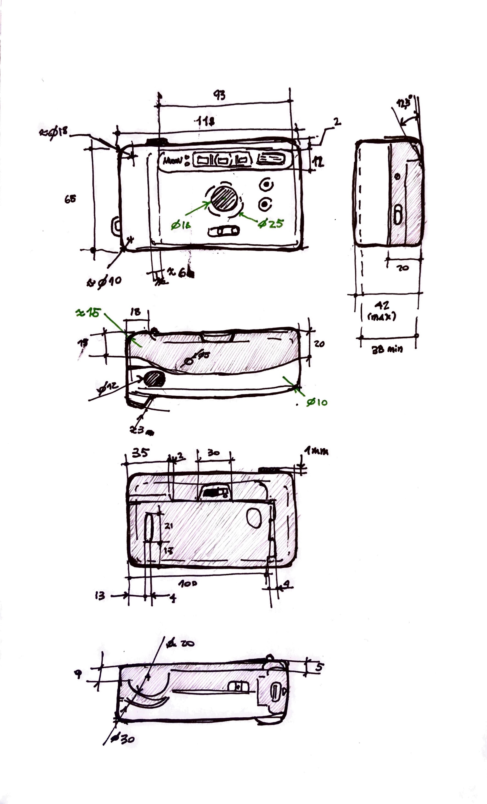

# MT02

## Introducción 
Bajo la premisa de modelar un objeto mi entorno, luego de hacer un relevamiento del posibles productos, opté por una cámara analógica compacta Nikon modelo Fun Touch 5, del año 1997. Las motivaciones detrás de esta elección son dos: Por un lado, es un objeto funcional y formalmente interesante de llevar a un modelo 3D; presenta varios botones y mecanismos, así como una morfología predominantemente orgánica, que puede resultar desafiante de replicar. La segunda razón es de corte “afectivo” y es que, si bien las cámaras fotográficas son objetos de mi interés, está en particular ha sido la cámara familiar de mi infancia. 

## Herramientas utilizadas
<ul><li><b>Modelado 3D:</b> Fusion 360</li>
<li><b>Trabajo vectorial:</b> Inkscape</li>
<li><b>Maqueteado y diagramación de lámina de presentación:</b> Affinity Publisher</li></ul>

## Proceso

### Relevamiento
Se comenzó realizando un relevamiento dimensional y formal del objeto. Para este fin se utilizó un calibre, regla, semicírculo transportador. 

 

### Trabajo 2D y vectorial
Para el trabajo vectorial se utilizó el software Inkscape. 
Por un lado, se editó un archivo con el logo de Nikon en formato .svg para eliminar el elemento ®, ya que este no era un objeto cerrado y podría presentar inconveniente al importarlo al software de modelado 3D, para incorporarlo al modelo.
Por otra parte, se generó un logo identificatorio personal para incorporarlo al modelo 3D, pero también para incorporarlo como elemento de identidad al sitio web (por ejemplo, como favicon) y para este proyecto.
Partiendo de un boceto en papel, se configuró una grilla de con módulos de 4x4 —subdivididas a su vez en 4x4— en donde a partir de figuras geométricas simples y operaciones booleanas, se representan las iniciales de mi nombre: P y C. 

Ambos elementos, tanto el logo personal como el de Nikon «arreglado», serían importados al modelo 3D como archivos .svg, en bajo y altorrelieve respectivamente.

### Modelado
A partir de las dimensiones relevadas se procedió a modelar el producto en el software de modelado 3D Fusion (anteriormente llamado Fusion 360). La decisión de utilizar este software, con el que ya tengo experiencia, se basa en poder practicar modelado de objetos y transiciones orgánicas, con el uso de <i>surfaces</i>.

El modelado se realizó partiendo de la generación de un volumen <i>base</i> mediante lofts. Esta geometría fue subdividida y modificada con volúmenes y planos añadidos y sustraidos, entre otros.

<iframe width="560" height="315" src="https://www.youtube.com/embed/DduWPy4OfHE?si=Bm7JMtazz6mKJG_T" title="YouTube video player" frameborder="0" allow="accelerometer; autoplay; clipboard-write; encrypted-media; gyroscope; picture-in-picture; web-share" referrerpolicy="strict-origin-when-cross-origin" allowfullscreen></iframe>

La pricipal dificultad encontrada en este proceso fue la realización de la transición en la zona del frente que sobresale, con la parte que «la recibe», pues incorpora elementos de corte orgánico sutiles en dos niveles de altura. Esto fue realizado con elementos de modelado de <i>surfaces</i>, pero se entiende que podría haber sido conveniente explorar herramientas de <i>form</i>.
Para dar con la forma deseada, se utilizaron en ocasiones reiteradas lofts y patches, muchas veces teniendo que subdividir el volumen para dar con ejes o perfiles que sirvieran para «apoyarse».

#### Preparación para impresión
El modelado fue realizado con la intención de dar con una representación fidedigna del producto real. Sin embargo, para poder desarrollar archivos que sean reproducibles mediante impresión 3D, fue necesario modifiar componentes del modelo, uniendo componentes y piezas para dar con mallas que no generen errores. A partir de eso se desarrollan 7 piezas en .STL.

 
 

 
 
 

## Resultados finales

 
 

#### Descarga de archivos
[Archivos .STL](<../archivos linkeados/MT02/Piezas STL>)
.F3D

### Lámina de presentación
[Ver lámina de presentación - Nikon FunTouch 5](<../archivos linkeados/MT02/Lamina presentacion - MT02.pdf>)

## Reflexiones y observaciones 
Como resultado de este ejercicio se pudo modelar en 3D un objeto que sirve tanto para realizar renders y visualización de productos, como para ser recreado mediante impresión 3D. Pero al tratarse de un producto que originalmente no está pensado para esta tecnología, sino que para inyección en plástico y cuyo mecanismo interno no es conocido completamente (ya que sería necesario desarmarlo y relevar el funcionamiento de los componentes a nivel mecánico), fue necesario adaptar el modelo desarrollado para que sea factible en impresión 3D, permitiendo aún así lograr renders que representen al producto real. 

Para lograr eso, en algunos componentes se requirió del desarrollo de <i>variantes</i> de aquellos originales, mediante la simplificación o combinación de piezas, teniendo en cuenta que a nivel de una potencial impresión 3D no serían funcionales (en tanto la finalidad del objeto, en este caso una cámara). Es por esto que el archivo final incorpora componentes tanto para visualización y para impresión, distinguidos en su denominación. Los casos puntuales donde sucede esto son la carcasa frontal y el protector del visor. 

A nivel del procedimiento desarrollado y las herramientas utilizadas, me resultó interesante el uso de herramientas que no utilizo con frecuencia, como es el caso de Inkscape. Si bien la he utilizado en el pasado, no recordaba que su uso fuera tan ameno como me resultó (probablemente producto de mejoras en el software) y a pesar de tener que adaptarme a otros workflows, ya que estoy acostumbrado a programas de manejo de vectores, como Illustrator, Indesign o Figma, no creo que Inkscape me haya limitado o que no haya logrado lo que tenia intención de hacer, entendiendo claro, que se trató de algo de baja complejidad. 
En ese sentido, consideraría utilizarlo a futuro, al menos para el diseño de elementos en 2d de baja complejidad y más aún si teniendo en cuenta que es un programa open source de fácil descarga e instalación. 

En relación al modelado 3D, entiendo que fue positivo el proceso, pues pude practicar en el trabajo con superficies en Fusion; aspecto que me resultaba de particular interés pues creo que son particularmente útiles (e igualmente complejas). Respecto al resultado alcanzado igualmente creo que hay varios aspectos y resoluciones que se podrían mejorar (o al menos resolver de forma más óptima) como la transición entre planos del frente del producto. 

Finalmente, si bien pretendía realizar los renders del producto en Blender, producto de querer optimizar tiempos, opté por realizarlo con el mismo Fusion. Y si bien me encontré con ciertas limitaciones, como el manejo de fuentes de luz o el trabajo con materiales, creo que es realmente práctico en casos donde se quiera iterar rápidamente en el desarrollo o modelado de un producto, pues se pueden lograr representaciones fieles, en poco tiempo. 