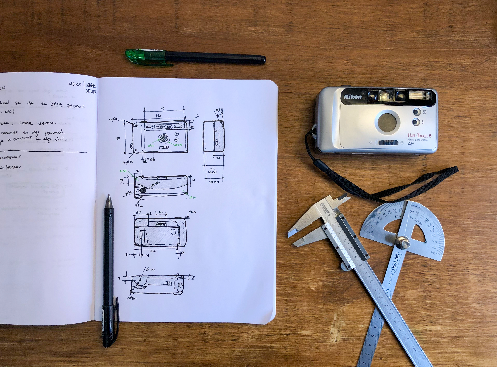

# MT02

## Introducción 
Bajo la premisa de modelar un objeto mi entorno, luego de hacer un relevamiento del posibles productos, opté por una cámara analógica compacta Nikon modelo Fun Touch 5, del año 1997. Las motivaciones detrás de esta elección son dos: Por un lado, es un objeto funcional y formalmente interesante de llevar a un modelo 3D; presenta varios botones y mecanismos, así como una morfología predominantemente orgánica, que puede resultar desafiante de replicar. La segunda razón es de corte “afectivo” y es que, si bien las cámaras fotográficas son objetos de mi interés, está en particular ha sido la cámara familiar de mi infancia. 

## Herramientas utilizadas
<ul><li><b>Modelado 3D:</b> Fusion 360</li>
<li><b>Trabajo vectorial:</b>Inkscape</li>
<li><i>Posibles de ser utilizadas más adelante: Indesign, Affinity Publisher, Blender</i></li></ul>

## Proceso

### Relevamiento
Se comenzó realizando un relevamiento dimensional y formal del objeto. Para este fin se utilizó un calibre, regla, semicírculo transportador. 

 

### Modelado
Una vez terminado, se procedió a modelar el producto en Fusion (anteriormente llamado Fusion 360). La decisión de utilizar este software se basa en poder practicar modelado de objetos orgánicos y con el uso de <i>surfaces</i>. 

### Creación y edición de vectores
Posteriormente en Inkscape se editó un archivo con el logo de Nikon en formato .svg para eliminar el elemento ®, ya que este no era un objeto cerrado y podría presentar inconveniente al importarlo al software de modelado 3D.
Una vez “arreglado” se importó el .svg al archivo con el modelo 3d y se optó por agregarlo en “altorrelieve” en la zona superior.

### Desarrollo de lámina de presentación

## Resultados finales

.png>)

### Descarga de archivos
.STL
.F3D

## Reflexiones y observaciones 
TBD...