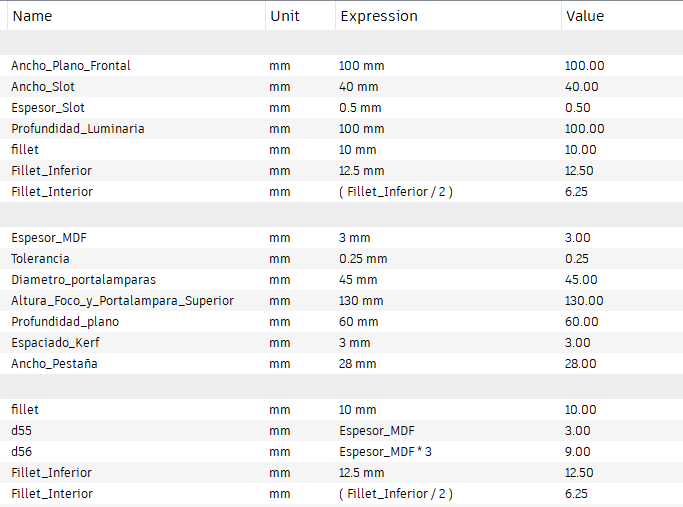
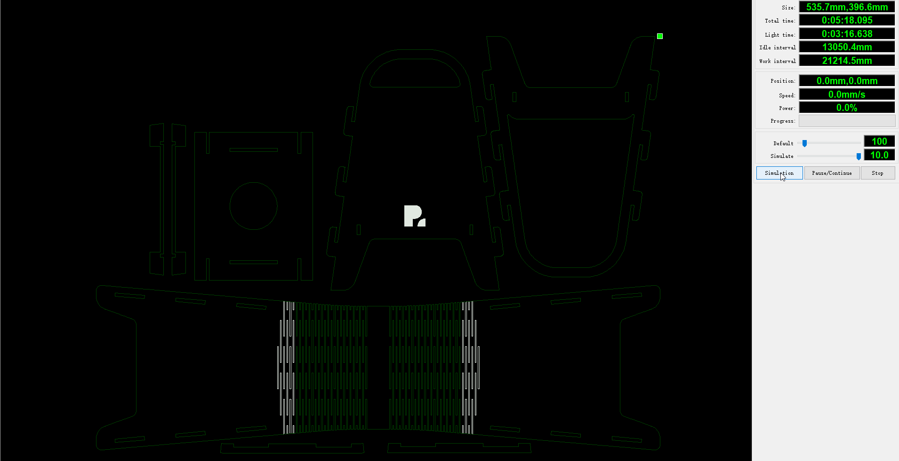

# MT03

## Introducción
Este módulo se centró en el corte láser controlado por computadora, así como su vinculación con diseño paramétrico y propuso como actividad el diseño de un objeto para ser producido mediante dicha tecnología.

<u>Lineamientos</u>

- Debe estar compuesto como mínimo por 3 piezas
- Las piezas de se fabrican mediante MDF de 3mm de espesor
- Debe ser ensamblable por encastres; no se permite incorporar uniones químicas o mecánicas externas
- Desarrollado mediante diseño paramétrico
- Es necesario que incorpore las tres operaciones básicas de la tecnología laser (corte, grabado y marcado)

## Herramientas utilizadas
<ul><li><b>Modelado 3D:</b> Fusion 360</li>
<li><b>Trabajo vectorial:</b> Inkscape, Illustrator</li>
<li><b>Preparación de G-code:</b> RD Works V.8</li></ul>

## Proceso

### Conceptualización
Luego de barajar distintas opciones, se opta por diseñar una luminaria que incorpore kerfing, tanto como elemento estético/morfológico, como funcional. Como punto de partida, el objeto es concebido como una iteración o como otro objeto de la misma línea de productos que una luminaria que desarrollé en equipo cuando era estudiante de Diseño Industrial.
A partir de esa idea, se empezaron a explorar distintas ideas a través de bocetos que, una vez definido el camino a seguir, fueron llevadas a un modelo 3d paramétrico.

### Modelado y parametrización
Partiendo del material definido por premisa (MDF 3mm) y de aspectos dimensionales considerados para la luminaria —que utilizará una lámpara y portalampara de rosca E27— se comenzaron a definir los primeros parámetros en el modelo 3D de la luminaria. A medida que fue avanzando el diseño del producto, se fueron definiendo otros que permiten que el producto sea en gran parte parametrizable y por ende, fácilmente adaptable, ya sea a materiales de otras dimensiones como a lámparas con distintas características funcionales.

#### Parametros desarrollados

El modelado fue realizado mayoritariamente el espacio de Fusion destinado a sólidos, sin embargo para el desarrollo de la parte plegable mediante kerfing, se utilizó el espacio de sheet metal, con el fin de poder configurar los cortes que lo conforman y luego desplegarlo para las operaciones de mecanizado laser. 

#### Kerfing

## Producto resultante
La luminaria desarrollada está conformada en su exterior por piezas planares encastrables, que configuran un volumen autoportante. En su interior, 5 piezas definen el soporte del portalámparas, que oficia también de refuerzo estructural.
El dispositivo fue concebido de forma tal que permite incorporar un elemento de difusión de la iluminación a modo de «pantalla», que puede ser realizado en papel u otro material laminar translúcido que puede ser incorporado con adhesivos. Su corte puede realizarse de forma manual o láser, aunque por las limitantes de la actividad no se presenta en los archivos finales para descargar.

## Desarrollo y preparación de archivos de corte láser
Una vez desarrollado el modelo, se dispuso de sus piezas en un plano para luego proyectar sus contornos en un sketch que pueda ser exportado en .dxf.

El archivo obtenido se ordena y emprolija en un programa de edición vectorial (Illustrator) para poder unir segmentos de líneas en segmentos continuos o compound paths, así como realizar un primer ordenamiento de capas según las operaciones a realizar. Este procedimiento tiene como objetivo simplificar el proceso de configuración del G-Code en RD Works.

Una vez en RD Works se le asigna a cada capa un tipo de operación, y por ende la velocidad y potencia que tendrá en el G-Code resultante, que ejecutará la máquina de corte láser. Asimismo se define el orden en que se ejecutará; esto es muy importante ya que si una pieza recibiera una operación de corte deja de estar fijada, por lo que un posterior grabado o corte podría no resultar de la precisión pretendida.

| Operación         | Potencia | Velocidad |
| :---------------- | :------: | :----:    |
| Corte             |   11.0%  | 300 m/s   |
| Grabado           |   12.0%  | 300 m/s   |
| Scan              |  100%    | 90.0 m/s  |

Inicialmente se optó por realizar tres operaciones, organizadas en tres capas (engrave, scan y cut). Sin embargo, luego de revisar y simular en RD Works el procedimiento se observó que ciertas piezas que quedaban diagramadas como «islas» bajo la operación de corte eran realizadas luego del corte de la pieza donde se alojaban. Por lo tanto, se optó por incluirlas en otra capa (que sería la penúltima, en color celeste) seguida de la del corte de las piezas exteriores (ver en color azul).

A continuación se puede ver una simulación del G-Code realizado:

### Descarga
[Archivo .dfx del producto para corte láser](<../archivos linkeados/MT03/MT03-Piezas corte laser.dxf>){:download="MT03_Luminara_corte_laser.dxf"}

[G-code realizado en RD Works v.8](<../archivos linkeados/MT03/MT03-Piezas corte laser.rd>){:download="MT03_Luminara_corte_laser_G-code.rd"}
