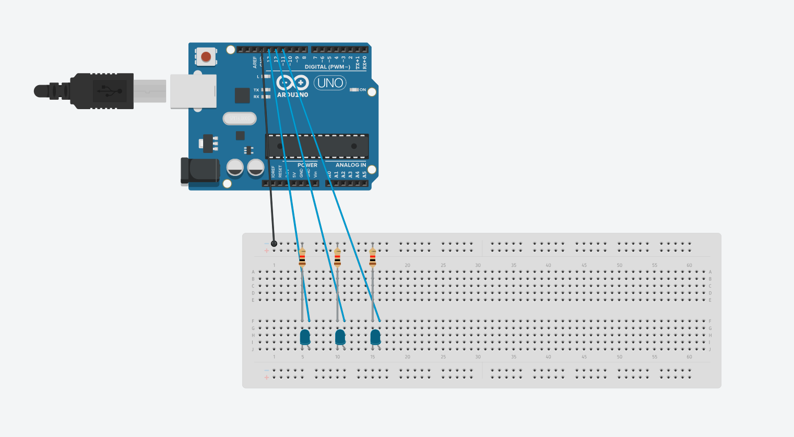

# MT04

## Introducción
Para el Módulo Técnico 04: Introducción a electrónica y programación (Arduino IDE) se propuso una introducción al mundo de la programación y electrónica aplicada en microcontroladores, mediante la plataforma Arduino IDE. 

En este contexto, se desarrollan una serie de actividades para poder adentrarme en conceptos básicos de esta tecnología y su aplicación, ya que más allá de conocer acerca del uso de Arduino, hasta el momento no tuve la oportunidad de adentrarme en esta tecnología.

Para la realización de las actividades del MT04 seguí una <i>metodología</i>, que se basó en:
- Revisión de materiales en la plataforma EDU
- Consulta de tutoriales sobre Arduino y las capacidades de dicha plataforma
- Revisión de capacidades de los distintos sensores presentes en el Ultimate Starter Kit for Uno R3 de Lanvin, que fue brindado para las actividades del módulo por UTEC.
- Replicado de tutorial en Tinkercad para simular el prototipado mediante Arduino
- Replicado mediante la utilización de componentes

## Actividad 0: Testeo en Tinkercad de sensor ultrasónico
Siguiendo el instructivo planteado por [BitwiseAr](https://www.youtube.com/watch?v=mlw3APOUt8U) se arma un circuito con un sensor ultrasónico HC-SR04 para medir distancia y encender un LED, para así cuando se detecte un elemento dentro de determinado rango.

En este caso, se armó el circuito a través de Thinkercad y posteriormente se generó el código en Arduino IDE. Si bien podría haber copiado el código brindado por quien desarrolló originalmente el circuito, me pareció adecuado escribirlo a medida que era explicado en el video, ya que de esta forma podría comprender un poco más la lógica detrás de este y su vinculación con la tecnología Arduino.

Captura del circuito prototipado en Tinkercad

Captura del código desarrollado

### Resultados
En primer lugar, pude entender más sobre la vinculación de la placa de arduino, con el tipo de programación que requiere y cómo interactúan. Asimismo, pude solucionar una serie de errores de sintaxis al contrastar el código escrito por mi con aquel provisto con el tutorial,esto sirvió para poder reforzar este tipo de programación.

Luego de escribir el código, lo llevé al <i>prototipo</i> en Thinkercad para poder simularlo en esa plataforma y comprobar que efectivamente funciona.

[Descargar archivo .ino - MT04-Actividad 00-Sensor_utrasonico-Thinkercad](<../archivos linkeados/MT04/MT04-Actividad 00-Sensor_utrasonico-Thinkercad/MT04-Actividad 00-Sensor_utrasonico-Thinkercad.ino>){:download="MT04-Actividad 00-Sensor_utrasonico-Thinkercad.ino"}

## Actividad 1
Para esta actividad, se plantea el desarrollo de un circuito simple que permita encender y apagar de forma automática 3 LEDs, tomando como referencia el tutorial propuesto por [DroneHow](https://www.youtube.com/watch?v=e1FVSpkw6q4).

Para esto, se comenzó por el armado del circuito en Thinkercad y posteriormente escritura del código en Arduino IDE, que posteriormente sería testeado en Thinkercad para verificar su funcionamiento, que posteriormente se replicó con los elementos del kit de Arduino provisto. 

Actividad 01 - Esquema del circuito

Actividad 01 - Testeo del circuito

La escritura del código era sencilla y la realización de esta acividad me permitió comprender con aun más la relación entre las variables que uno define y lo que hace cada pin, realizado en el setup. Al momento de querer transferir el código a la placa de Arduino se detectaron dos errores causados por sintaxis; en ambos casos se debía a la falta del caracter <b>;</b>.

Primer error detectado

Segundo error detectado

Componentes utilizados

Circuito armado

Detalle del sistema

### Resultados
Se pudo lograr el armado de un circuito funcional de muy baja complejidad, así como se pudo ajustar parámetros de duración de su encendido a través del código para explorar distintos patrones de duración de los encendidos.

Sistema encendido

LEDs en funcionamiento

<iframe width="560" height="315" src="https://www.youtube.com/embed/l5Wrl_DWqaM?si=PFZOqji-Yw67LVgX" title="YouTube video player" frameborder="0" allow="accelerometer; autoplay; clipboard-write; encrypted-media; gyroscope; picture-in-picture; web-share" referrerpolicy="strict-origin-when-cross-origin" allowfullscreen></iframe>

[Descargar archivo .ino - MT04-Actividad 01-Leds_intermitentes](<../archivos linkeados/MT04/MT04-Actividad 01-Leds_intermitentes_v2/MT04-Actividad 01-Leds_intermitentes_v2.ino>){:download="MT04-Actividad 01-Leds_intermitentes.ino"}

## Actividad 2
A partir del código escrito en la Actividad 0 me propuse prototipar con los elementos del kit el circuito planteado. Al tenerlo diagramado y poder consultarlo, fue fácilmente replicable en la realidad.

Código desarrollado en la actividad 0

Armado inicial del sistema

La carga del código al Arduino no presentó ninguna dificultad, sin embargo la situación era diferente con la captación de datos por parte del sensor, que presentaban una serie de errores.

En primer lugar, el LED incorporado, que se debe parpadear con un ritmo variable dependiendo de la distancia del objeto que el sensor ultrasónico HC-SR04 detecta, emitía una luz tenue y prácticamente imperceptible. Por otra parte, el <i>serial monitor</i> de Arduino IDE, solamente presentaba valores de 0. 

Enciendido y prueba de funcionamiento 1

Enciendido y prueba de funcionamiento 2

<iframe width="560" height="315" src="https://www.youtube.com/embed/qMEezTK5MOY?si=PJplJr6FlOYdWy-G" title="YouTube video player" frameborder="0" allow="accelerometer; autoplay; clipboard-write; encrypted-media; gyroscope; picture-in-picture; web-share" referrerpolicy="strict-origin-when-cross-origin" allowfullscreen></iframe>
Video que captura el Serial Monitor captando siempre el valor «0»

Estos elementos dieron a entender que algo andaba mal, pero sin saber si se trataba de algo del código, del armado del circuito o algún componente defectuoso. Asì que para poder dar con el problema, seguì los siguientes pasos:

Reemplazar el LED: si bien en el mejor de los casos resolvería uno de los problemas, era algo que valía la pena intentar. Lamentablemente, no se obtuvieron resultados.
Verificar que los conectores estaban colocados correctamente según el esquema desarrollado en tinkercad y contrastar ambos con el tutorial; asimismo se chequeó que los elementos estuvieran firmemente conectados. Esto tampoco dió solución.
Googlear directamente mi problema: <i>multicomp hc-sr04 not showing values arduino</i>. Esto arrojó muchos resultados y potenciales soluciones, como probar de cambiar las conexiones en el circuito o hacer ajustes en el código.  Si bien en determinado momento esto pareció dar solución, ya que el led se encendió en una instancia con una notoria intensidad, posteriormente no se pudo replicar.
Contrastar con el material brindado en el tutorial mencionado en la actividad 0 y en los comentarios. De ahí se tomaron dos medidas que contribuyeron a solucionar el problema, como conectar los elementos del breadboard más cerca del los demás elementos del circuito y (lo que probablemente fue la clave)  hacer un pequeño cambio al código, según plantea el comentario de un usuario de youtube: «en el setup, debes inicializar el TRIG como LOW».

### Resultados
A partir de lo realizado en la actividad 0 y 2 se logró completar el circuito que permite, a través del sensor ultrasónico, medir la distancia a la cual se encuentra un determinado objeto. Esta distancia de proximidad es comunicada tanto por la interfaz provista por el <i>serial monitor</i> de Arduino IDE, como por el LED del circuito, que oficia de indicador al titilar con más o menos frecuencia dependiendo de la cercanía del objeto percibido. 

Sistema funcionando una vez resuelto el error

<iframe src="https://player.vimeo.com/video/972599092?badge=0&amp;autopause=0&amp;player_id=0&amp;app_id=58479" frameborder="0" allow="autoplay; fullscreen; picture-in-picture; clipboard-write" style="position:absolute;top:0;left:0;width:100%;height:100%;" title="MT04 - Actividad 2 - Lectura del sensor - Made with Clipchamp"></iframe>

Circuito en funcionamiento

<iframe width="560" height="315" src="https://www.youtube.com/embed/PkuMGuNilck?si=VFNSu3BKBNNrQSdj" title="YouTube video player" frameborder="0" allow="accelerometer; autoplay; clipboard-write; encrypted-media; gyroscope; picture-in-picture; web-share" referrerpolicy="strict-origin-when-cross-origin" allowfullscreen></iframe>
Circuito captando valores que se reflejan en el Serial Monitor

Por otra parte se optó por probar la incorporación de un <i>passive buzzer</i> en lugar del circuito LED+resistencia,  solamente con fines de utilizar otro elemento del kit, lo que se pudo hacer sin dificultad alguna.

Buzzer incluido en el sistema

<iframe src="https://player.vimeo.com/video/972599333?badge=0&amp;autopause=0&amp;player_id=0&amp;app_id=58479" frameborder="0" allow="autoplay; fullscreen; picture-in-picture; clipboard-write" style="position:absolute;top:0;left:0;width:100%;height:100%;" title="MT04 - Actividad 2 - Lectura buzzer"></iframe>

Buzzer en funcionamiento

[Descargar archivo .ino - MT04-Actividad 02-Sensor_utrasonico](<../archivos linkeados/MT04/MT04_Actividad_02_Sensor_utrasonico/MT04_Actividad_02_Sensor_utrasonico.ino>){:download="MT04-Actividad 02-Sensor_utrasonico.ino"}

## Conclusiones y observaciones
Como resultado de las actividades desarrolladas en el presente módulo pude acercarme al uso de Arduino para prototipado de circuitos y la programación en entornos IDE, de forma inicial.

Personalmente, me resulta de gran interés esta tecnología y entiendo que ofrece un gran número de potenciales usos y aplicaciones, aunque producto de mi inexperiencia en la temática, no solo no pueda ver y comprender todo lo que ofrecen, sino que claramente no sabría cómo llevarlas a cabo. En este sentido, me entusiasma la idea de seguir profundizando en la tecnología Arduino. 

Asimismo, la serie de ejercicios realizados me disparan la siguiente inquietud: ¿cómo podría hacer para incorporar Arduino en mi proyecto final?
