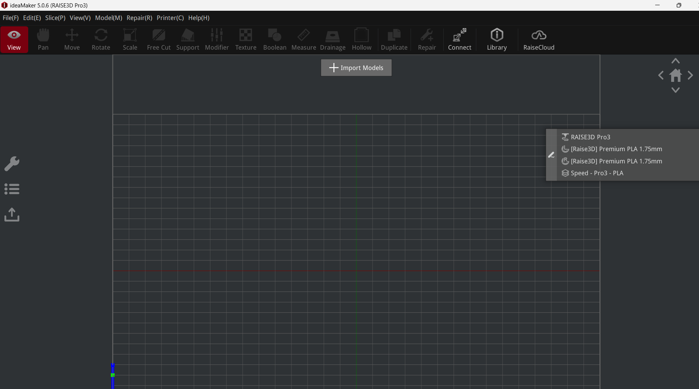
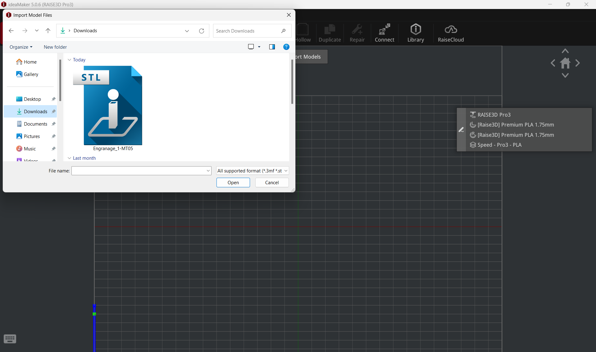
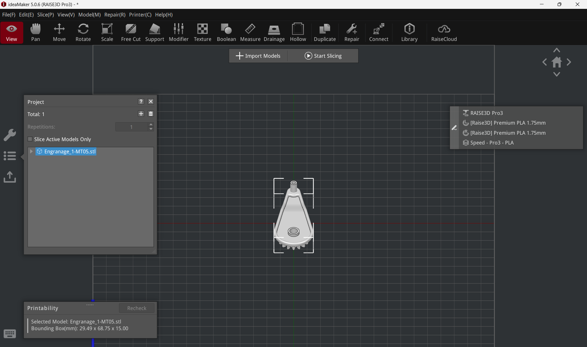

# MT05

## Introducción
En este módulo del Diploma de Especialización en Fabricación Digital se abordan las temáticas de impresión y el escaneo 3D. Con este fin, se desarrollan 2 ejercicios: En primer lugar, se configura un modelo 3D para su posterior impresión. Posteriormente, se lleva a cabo del desarrollo del escaneo de un modelo mediante una aplicación para smartphones.

## Impresión 3D
En esta primera parte de desarrolla el proceso necesario para convertir un archivo 3D —en este caso se trata de un archivo en formato .f3d— en un archivo .gcode que pueda ser utilizado para su impresión 3D.
Para esto, es necesario convertir el archivo en una malla en formato .stl y luego importarlo en un programa de <i>slicing</i>, para procesar y configurar el archivo.

¿A que se refiere el término slicing? En términos generales, en impresión 3D de tipo FDM se refiere al proceso por el cual un archivo 3D es segmentado en distintas capas que pueden ser procesadas por la impresora para pasar el archivo digital a una impresión.

### 01 | Conversión del archivo
Se convierte el archivo .f3d de Fusion en un archivo .stl.

### 02 | Importación
Se importa el archivo.stl ya convertido al software de slicing IdeaMaker

Pantalla de inicio de IdeaMaker

 
Importación del archivo .stl

Vista del modelo importado

### 03 | Seteo

#### 03.a | Configuración de la malla importada
Una vez importada la malla en IdeaMaker se desarrollan una serie de pasos para configurarla:

- En primer lugar se procede a escalar la malla a un 150%
- Se procede a disponerla en el espacio según la posición que se entiende que lograrìan una mejor realización de la impresión, una mejor resolución y propiedades mecánicas.
En este sentido, se opta por una orientación donde los elementos las caras planas de los elementos cilíndricos sean perpendiculares al plano de la cama —evitando así que la gravedad vaya en contra de sus curvas y potencialmente genere deformaciones— y haciendo que los engranajes queden hacia arriba, para así evitar tener que incorporar soportes en caso de que necesiten soportes. 

La diferencia entre ambas configuraciones es de 2 horas 46 minutos vs 2 horas 22 minutos. Si bien se opta por un posicionamiento que lleva 20 minutos más aproximadamente, se entiende que puede ser beneficioso partiendo de la idea de que las piezas del engranaje deben quedar con la mejor definición posible, lo que en caso de recibir soportes no sucedería.

#### 03.b | Configuración del slicing

Se selecciona el perfil de laminado a utilizar. Para esta parte se toma como referencia los parámetros y recomendaciones que parten de los lineamientos de las máquinas utilizadas en los FabLabs de UTEC.

- En primer lugar, se selecciona como impresora a utilizar la RAISE3D Pro2 Plus
- Luego, se indica que la impresión se realice con el extrusor izquierdo
- Posteriormente, se selecciona la configuración para el extrusor izquierdo para utilizar filamento de PLA de 1,75mm de diámetros.
- - Utilizando el submenú dentro de esa sección correspondiente a la plantilla se verifica que se le asigne una altura de capa de 0.2mm así como 2 perímetros de pared.
- -  Se le asigna también una balsa (conocido en inglés como Raft) 
- - Se selecciona que incluya soportes (opción all) y que también tenga un infill de 10%. Estos valores se extraen de los valores provistos en los tutoriales disponibles en la plataforma EDU.

### 04 | Resultado
Como resultado del proceso de preparación del modelo 3D inicial y su posterior sliceo se obtiene un archivo .gcode que permitiría su impresión en impresoras RAISE3D Pro2 Plus.
[Descargar archivo .gcode para RAISE3D Pro2 Plus](<../archivos linkeados/MT05/Pablo_Castro.gcode>){:download="MT05-Pablo-Castro.gcode"}

## Escaneo 3D
Aquí se plantea el escaneo 3D de la luminaria desarrollada en el MT03, mediante la utilización de la app [Polycam](https://poly.cam/).

