# MT05

## Introducción
En este módulo del Diploma de Especialización en Fabricación Digital se abordan las temáticas de impresión y el escaneo 3D. Con este fin, se desarrollan 2 ejercicios: En primer lugar, se configura un modelo 3D para su posterior impresión. Posteriormente, se lleva a cabo del desarrollo del escaneo de un modelo mediante una aplicación para smartphones.

## Impresión 3D
En esta primera parte de desarrolla el proceso necesario para convertir un archivo 3D —en este caso se trata de un archivo en formato .f3d— en un archivo .gcode que pueda ser utilizado para su impresión 3D.
Para esto, es necesario convertir el archivo en una malla en formato .stl y luego importarlo en un programa de <i>slicing</i>, para procesar y configurar el archivo.

¿A que se refiere el término slicing? En términos generales, en impresión 3D de tipo FDM se refiere al proceso por el cual un archivo 3D es segmentado en distintas capas que pueden ser procesadas por la impresora para pasar el archivo digital a una impresión.

### 01 | Conversión del archivo
Se convierte el archivo .f3d de Fusion en un archivo .stl.

### 02 | Importación
Se importa el archivo.stl ya convertido al software de slicing IdeaMaker

Pantalla de inicio de IdeaMaker

 
Importación del archivo .stl

Vista del modelo importado

Modelo importado en IdeaMaker

### 03 | Seteo

#### 03.a | Configuración de la malla importada
Una vez importada la malla en IdeaMaker se desarrollan una serie de pasos para configurarla:

En primer lugar se procede a escalar la malla a un 150%.
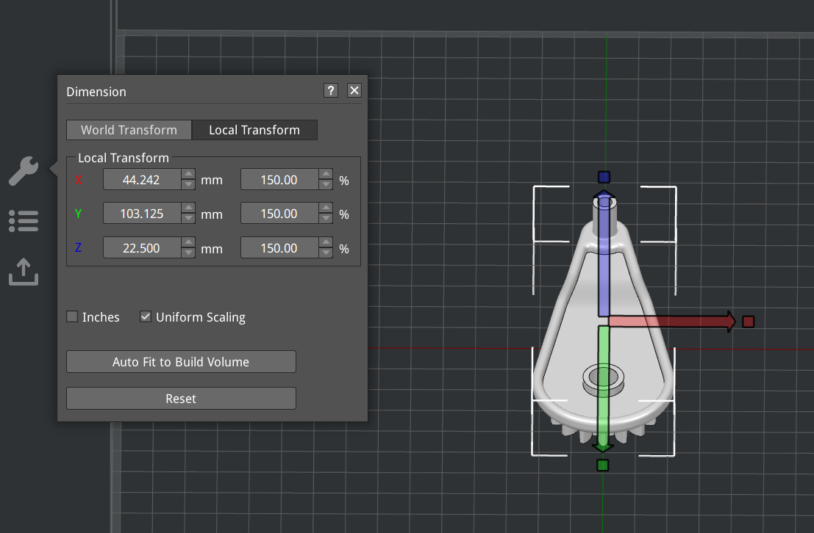
Escalación del modelo

Se procede a disponerla en el espacio según la posición que se entiende que lograrìan una mejor realización de la impresión, una mejor resolución y propiedades mecánicas.

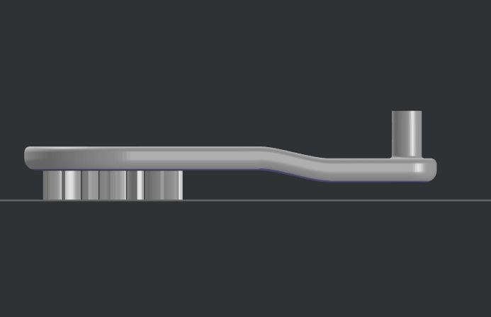
Posición original del modelo importado

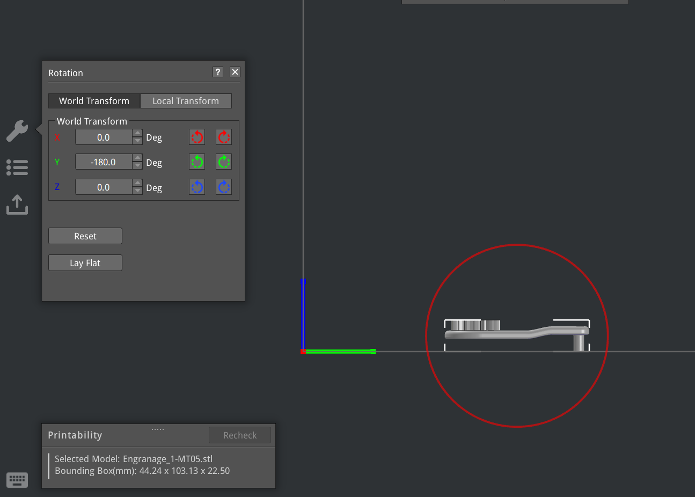
Rotación del modelo 180º

En este sentido, se opta por una orientación donde los elementos las caras planas de los elementos cilíndricos sean perpendiculares al plano de la cama —evitando así que la gravedad vaya en contra de sus curvas y potencialmente genere deformaciones— y haciendo que los engranajes queden hacia arriba, para así evitar tener que incorporar soportes en caso de que necesiten soportes. 

La diferencia entre ambas configuraciones es de 2 horas 46 minutos vs 2 horas 22 minutos. Si bien se opta por un posicionamiento que lleva 20 minutos más aproximadamente, se entiende que puede ser beneficioso partiendo de la idea de que las piezas del engranaje deben quedar con la mejor definición posible, lo que en caso de recibir soportes no sucedería.

#### 03.b | Configuración del slicing

Se selecciona el perfil de laminado a utilizar. Para esta parte se toma como referencia los parámetros y recomendaciones que parten de los lineamientos de las máquinas utilizadas en los FabLabs de UTEC.

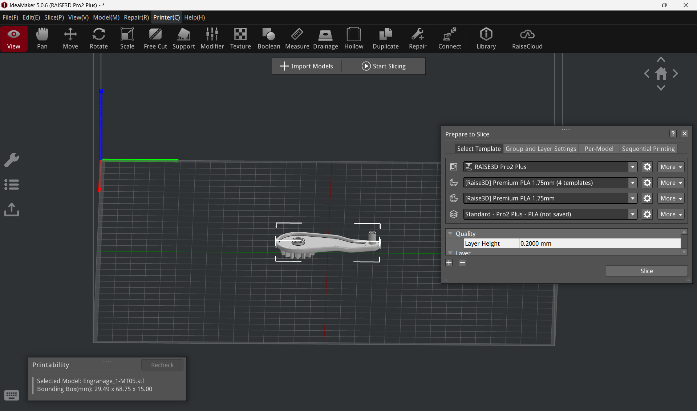
Vista de la pieza para configurar el slicing, para lo que se utiliza el menú desplegable de la izquierda y derecha (<i>Prepare to slice</i>)

En primer lugar, se selecciona como impresora a utilizar la RAISE3D Pro2 Plus.
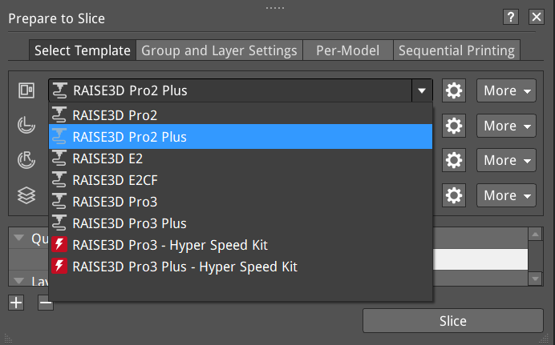
Selección de impresora

Luego, se indica que la impresión se realice con el extrusor izquierdo
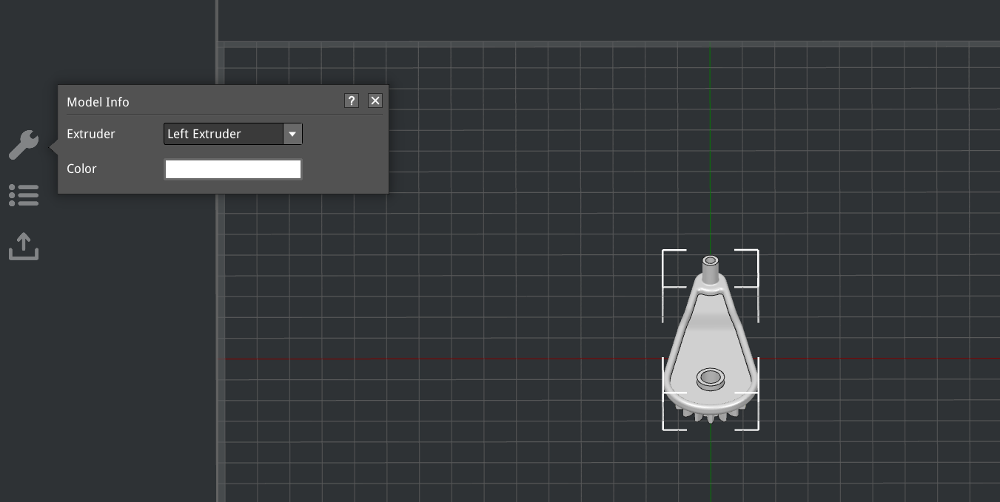
Selección de extrusor

Posteriormente, se selecciona la configuración para el extrusor izquierdo para utilizar filamento de PLA de 1,75mm de diámetros.
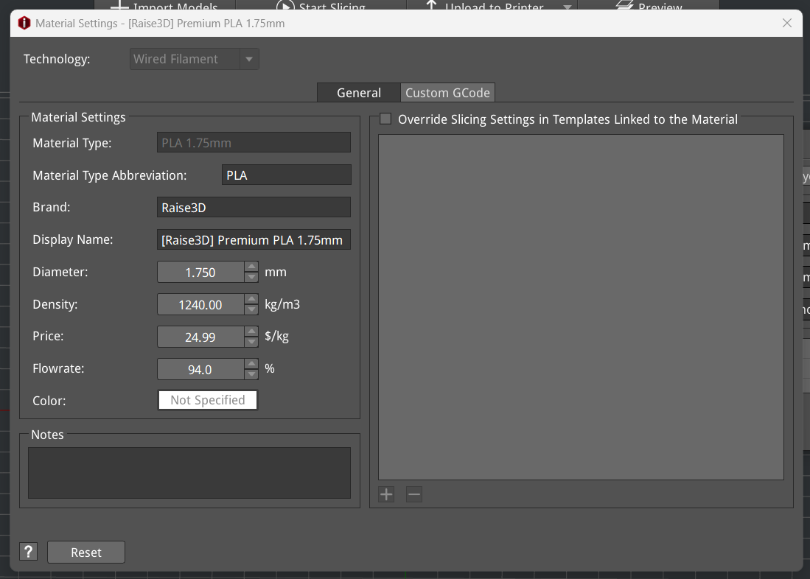
Selección de material

Utilizando el submenú dentro de esa sección correspondiente a la plantilla del material seleccionado, se verifica que se le asigne una altura de capa de 0.2mm así como 2 perímetros de pared. Se le asigna también una balsa (conocido en inglés como Raft) y también se selecciona que incluya soportes (opción all) y que también tenga un infill de 10%. Estos valores se extraen de los valores provistos en los tutoriales disponibles en la plataforma EDU.

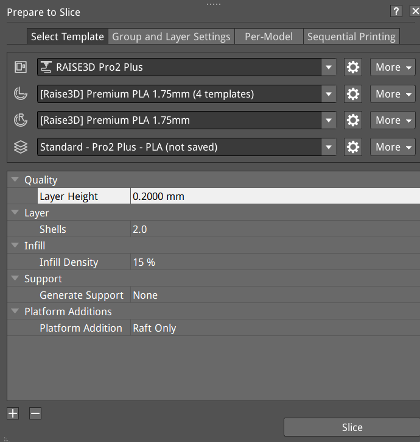
Configuración de aspectos de la impresión

### 04 | Resultado
Como resultado del proceso de preparación del modelo 3D inicial y su posterior sliceo se obtiene un archivo .gcode que permitiría su impresión en impresoras RAISE3D Pro2 Plus.

Visualización de la simulación del slicing. Para guardar el archivo .gcode se selecciona el desplegable presente en <i>Upload to printer</i> y se selecciona <i>Export to local disc</i>

[Descargar archivo .gcode para RAISE3D Pro2 Plus](<../archivos linkeados/MT05/Pablo_Castro.gcode>){:download="MT05-Pablo-Castro.gcode"}

### 05 | Conclusiones
Como resultado de este módulo se logró desarrollar un archivo .gcode para la impresora 3D utilizada en los Fab Labs de UTEC. Para esto, fue necesario utilizar un software de slicing que me era desconocido, pues he utilizado anteriormente Cura. Si bien son programas distintos, manejan lógicas similares, por lo que se pueden trasladar sin mucha complejidad los conocimientos del manejo de uno al otro aunque IdeaMaker me resultó un poco menos intuitivo.

Una dificultad con la que me encontré, tuvo lugar al momento de tomar partido por la disposición del modelo a imprimir, ya que desconocía su finalidad y funcionamiento. Entiendo que de haber contado con esa información podría haber tomado más fácilmente esa decisión, en especial en relación a la resistencia mecánica necesaria.

## Escaneo 3D
Aquí se plantea el escaneo 3D de la luminaria desarrollada en el MT03, mediante la utilización de la app [Polycam](https://poly.cam/).
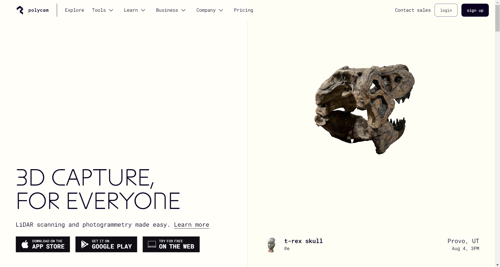

### 01 | Desarrollo
Antes de llevar adelante el escaneo 3D de la pieza, se navegó en la interfaz de la aplicación para poder conocerla.

Al abrir la app, aparece una pantalla similar a la de una cámara común, donde se puede optar por registrar mediante filmación o mediante una secuencia de fotos. Luego de probar, me resultó más práctica esta última opción, ya que permite un mayor control de las fotos a tomar. La interfaz va indicando cuantas fotografías se han registrado, para alcanzar un mínimo que permita su procesamiento.

Vista con la opción de grabar seleccionada
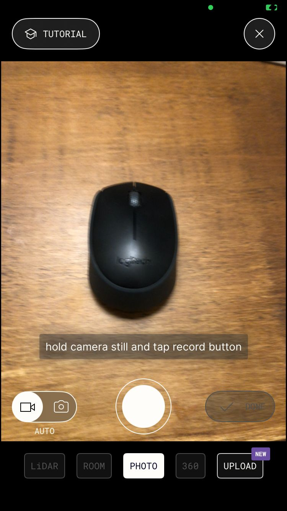

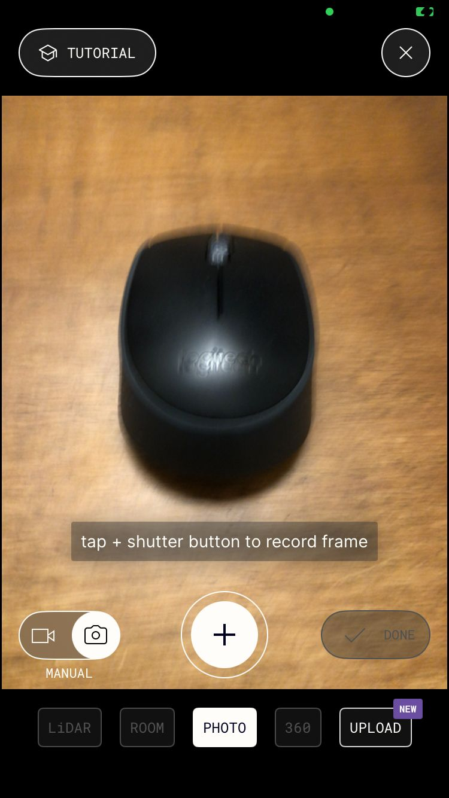
Vista con la opción de tomar fotos seleccionada

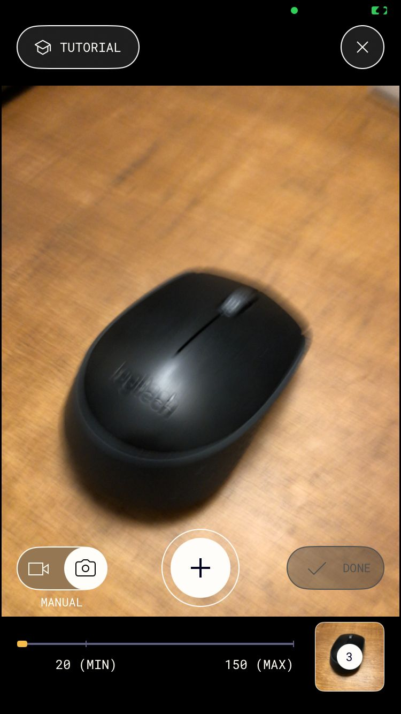
Captura en proceso, indicando la cantidad actual y los mínimos necesarios

Una vez tomadas las fotografías, el software las procesa y da como resultado un modelo 3D. Este puede procesarse con distintos métodos (en la versión gratuita son limitadas algunas opciones) y permite realizar <i> object masking</i>, lo que permite capturar al modelo independientemente del fondo.
Cabe señalar que una vez obtenido el modelo, se puede volver a procesar.

### 02 | Observaciones

Al realizar pruebas de escaneo pude observar que:
- Para fotografías de un producto, una dificultad es que la cámara capta no sólo al sujeto, sino que también al entorno. Esto puede deberse a aspectos del software, pero también de la cámara del teléfono utilizado, ya que en mi caso se trata de una relativamente vieja (Iphone 8). Puede que otro con diferentes tipos de lentes y cámaras permitan un mejor trabajo

- Es necesario poder acceder al objeto desde distintas vistas, lo más «despejadas» de objetos que sea posible. En este sentido, utilizar una mesa por la que uno pueda circular, o colocar el objeto en el piso pueden ser buenas opciones

- La estabilidad al registrar y registrar una buena cantidad de fotografías son aspectos que mejoran el resultado obtenido

### 03 | Resultados
Como resultado del escaneo realizado, se pudo registrar el objeto producido en el MT03, así como el entorno donde se lo ubico. Si bien esto último no era parte de los planes, resultó interesante para conocer el nivel de detalle que el software permite obtener y la información que capta. Asimismo, al poder reprocesar el escaneo, se logra obtener el objeto de forma <i>independiente</i> y experimentar en distintas configuraciones.

Objeto capturado con fondo e información adicional
<iframe width="560" height="315" src="https://www.youtube.com/embed/h1TaBn_sjJ4?si=tXNGN5T5epBnxVx-" title="YouTube video player" frameborder="0" allow="accelerometer; autoplay; clipboard-write; encrypted-media; gyroscope; picture-in-picture; web-share" referrerpolicy="strict-origin-when-cross-origin" allowfullscreen></iframe>

Objeto reprocesado
<iframe width="560" height="315" src="https://www.youtube.com/embed/mJ8EPLwdtnw?si=Gdg7bLT6LoatHFOW" title="YouTube video player" frameborder="0" allow="accelerometer; autoplay; clipboard-write; encrypted-media; gyroscope; picture-in-picture; web-share" referrerpolicy="strict-origin-when-cross-origin" allowfullscreen></iframe>

[Descargar archivo .gltf del escaneo de la luminaria](<../archivos linkeados/MT05/Escaneo luminaria MT03.glb>){:download="MT05-Escaneo-luminaria.gcode"}

### 04 | Conclusiones
Como resultado de la experimentación con escaneo 3D, arribé a las siguientes conclusiones:

En primer lugar, creo que el resultado hubiera mejorado con más fotografías —en particular desde el frente del producto en un plano contrapicado— y en un fondo despejado, con un mayor contraste y menos elementos «extra» en el fondo. Cabe señalar que estos dos últimos fueron limitantes del contexto en el que me ubicaba al desarrollar la actividad.

Respecto al software, si bien creo que es simple de utilizar y permite alcanzar buenos resultados, dando la posibilidad de visibilizar el archivo tanto en web como en mobile, es bastante limitado fuera de su versión pro, pues limita las opciones de procesado y de formatos de exportación. En consecuencia, creo necesario experimentar con otros softwares de escaneo, pues sería positivo acceder a otras posibilidades de procesamiento y exportación.

Finalmente, entiendo que esta tecnología es de mi interés, pues creo que me puede ser útil para actividades como el registro de objetos y espacios, la realización de renders donde se incluyan modelos escaneados, así como su potencial uso para registrar prototipos o maquetas y su posterior comunicación a terceros, en especial si incorporara el uso de realidad aumentada.