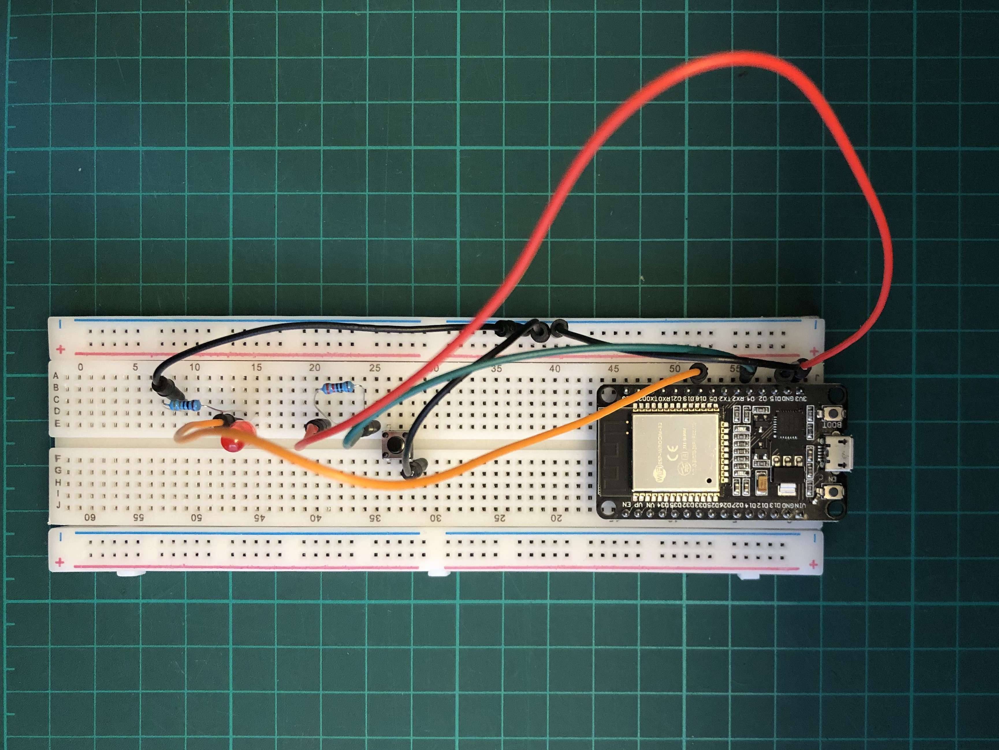
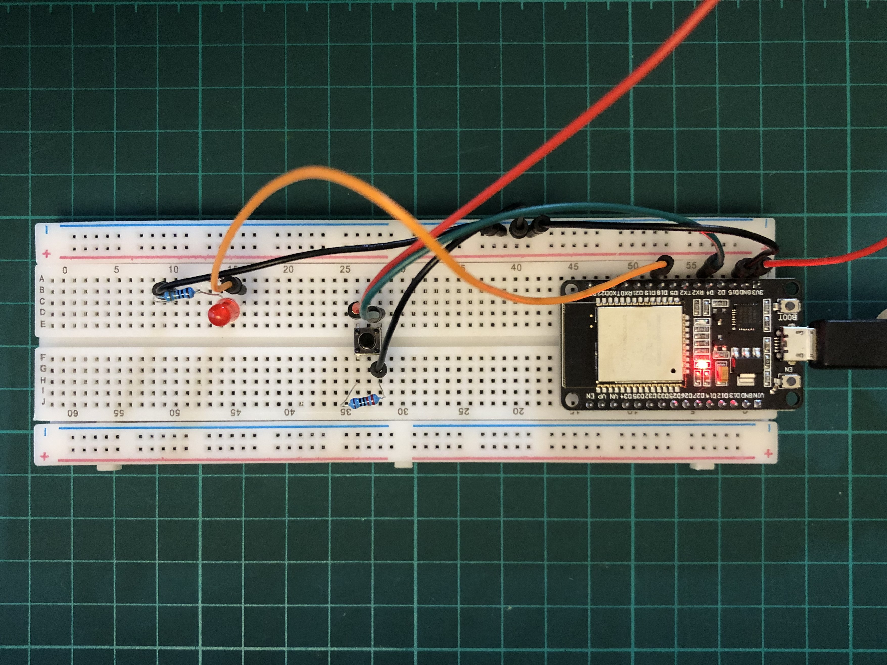
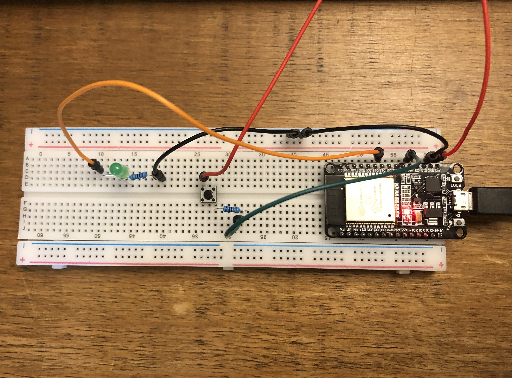
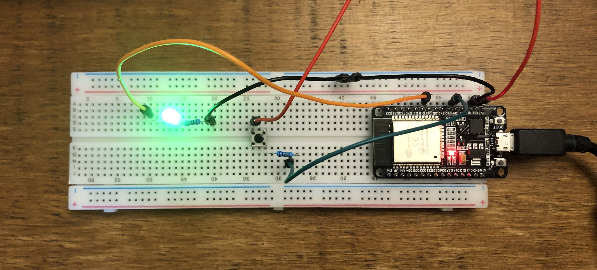
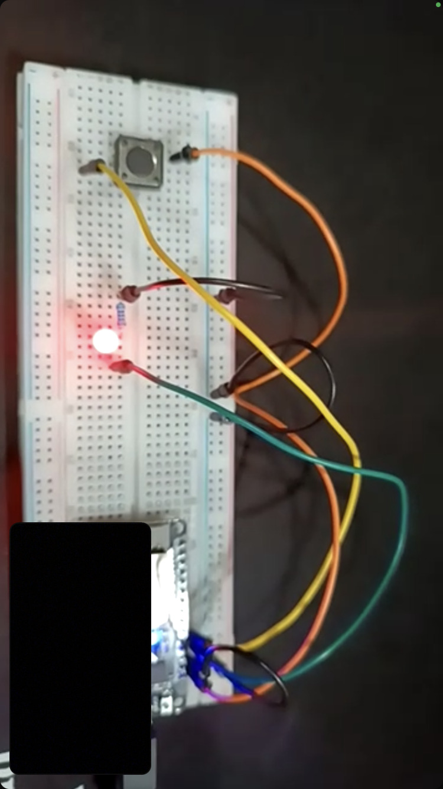
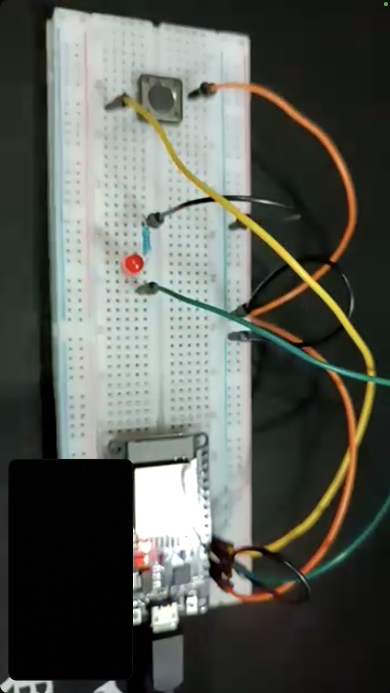

# MT06
#MT06

## Introducción
El módulo técnico 06 se centró en la temáticas de <b>networking</b>, donde se abordaron las temáticas de redes, comunicación, y sistemas MQTT.

Las redes son utilizadas, en conjunto con protocolos de comunicación, para distribuir y conectar sistemas, ya que presentan una serie de beneficios:
Permiten realizar tareas de procesamiento y cálculo de datos en distintos lugares, independientemente de la ubicación
Posibilitan la realización de tareas en paralelos
Dan lugar al desarrollo basado en módulos con funciones y roles determinados; esto facilita su escalabilidad y reparación
Evitan la interferencia entre sí de los sistemas

En este punto cabe preguntarse  <b>¿qué se entiende por red? </b>. Una red es un conjunto de ordenadores conectados entre sí mediante líneas de comunicación. Las redes utilizan protocolos para intercambiar información; estas son normas sobre formatos de mensajes y procedimientos que lo posibilitan.

El MT06 se centró en la utilización del protocolo MQTT en proyectos de Arduino, más precisamente en placas microcontroladoras ESP32. Dicho protocolo tiene como finalidad ser eficiente en el ancho de banda y en el consumo de energía. Para eso, utiliza un modelo basado en la idea de publicar y suscribirse a <i>eventos</i>, lo que permite enviar mensajes en torno a un tema en particular.

## Actividad
Para la actividad a desarrollar en el marco del MT06 se propone, a través de MQTT y mediante un ESP32, leer un input, publicarlo y suscribirse a otra publicación de un input para controlar un actuador.

### Actividad 1
En base a un circuito y un código dado en clase, se plantea el desarrollo de un intento de comunicación serial, utilizando la plataforma [Wokwi](https://wokwi.com/) para simular los circuitos y su programación.

[Acceder a la simulación y el código](https://wokwi.com/projects/409416906012160001)

Para realizar dicha actividad, se plantean dos topic desde los cuales suscribir y enviar mensajes: Pablo y Pablo2

Cada uno de estos nombre es utilizado, en un caso como <i>name_topic</i> y en otro como <i>name_send</i>, para posibilitar la comunicación entre ambos, donde al pulsar un boton del circuito(input), se enciente LED (output).

<iframe width="560" height="315" src="https://www.youtube.com/embed/cMFzcDBYPjc?si=5px3ViJdj7c5fq2i" title="YouTube video player" frameborder="0" allow="accelerometer; autoplay; clipboard-write; encrypted-media; gyroscope; picture-in-picture; web-share" referrerpolicy="strict-origin-when-cross-origin" allowfullscreen></iframe>

### Actividad 2
Para la segunda actividad se plantea desarrollar la comunicación entre dos partes utilizando como punto de partida el circuito elaborado en la actividad anterior. En este caso se plantea desarrollar el circuito utilizando un ESP32 real, así como demás componentes necesarios, para logra la comunicación tanto con una computadora (a través de Wokwi), como con un compañero del EFDI.

#### Desarrollo y exploración
El desarrollo de esta segunda actividad implicó numerosas exploraciones en el armado del circuito y en los códigos realizados en Wokwi y en Arduino IDE. 

En primer lugar, fue necesario trasladar el circuito de referencia a uno real, con los componentes con los que se contaba (ESP32, breadboard, cables, resistencias, botón y LED). Es así que fue necesario reubicar las conexiones de los conectores de acuerdo a las características del ESP32 a utilizar ya que, a diferencia de aquel de Wokwi, no cuenta con los mismos pines.  Por lo tanto, el del LED pasó del 13 al 18 y el del botón, del 0 al 4.

Distintos armados de circuitos fueron llevados a cabo, así como de sus códigos correspondientes, para lograr la comunicación entre el circuito físico y aquel simulado. En los distintos intentos se logró establecer conexión entre ambos, pero sin lograr que se pueda encender el LED al presionar el botón en ninguno de los casos.

Fotografías de algunos de los circuitos testeados:

 

Seleccion de armados y configuraciones armadas en simuladores:
[Acceder al test v1](https://wokwi.com/projects/409753943240655873)
[Acceder al test v2](https://wokwi.com/projects/409767867121657857)
[Acceder al test v3](https://wokwi.com/projects/409770897428862977)

#### Resolución
Para la resolución del ejercicio se volvió a plantear un nuevo armado y revisión del circuito, así como del desarrollo del código. En este caso, ambos funcionaron, lo que posibilitó que se pudiera lograr la comunicación entre el circuito armado y la simulación, así como la comunicación a distancia del circuito por parte de un compañero de la especialización. 

Circuito armado

<iframe width="560" height="315" src="https://www.youtube.com/embed/NwVk_733KyI?si=ay7aodej-xAnTjuI" title="YouTube video player" frameborder="0" allow="accelerometer; autoplay; clipboard-write; encrypted-media; gyroscope; picture-in-picture; web-share" referrerpolicy="strict-origin-when-cross-origin" allowfullscreen></iframe>

La comunicación a distancia por parte de un compañero fue lograda a través del uso de un simulador y del circuito armado. Ambos participantes pudimos enviar y recibir señales de esta forma.

 
 

Comunicación de circuito de compañero a distancia

[Acceder a la simulación y código para la comunicación entre la placa y su versión simulada ](https://wokwi.com/projects/409774221190537217)
[Acceder a la simulación y código para la comunicación con una placa a distancia](https://wokwi.com/projects/409774221190537217)

[Descargar archivo Arduino .ino](<../archivos linkeados/MT06/MT06.ino>){:download="MT06-Pablo-Castro.ino"}

## Conclusiones y reflexiones
Como resultado de este módulo y del ejercicio propuesto se pudo iniciar a comprender la temática de redes mediante MQTT y su utilización a través de Arduino. 
La temática me resultó de gran interés, aunque igualmente desafiante y complicada. En el caso de la segunda actividad desarrollada pude dar con su solución luego de numerosos intentos y pruebas, así como de la indispensable asistencia de compañeros y compañeras del EFDI. Sin embargo no estoy muy seguro de por qué pude finalmente lograr la actividad propuesta o qué fue lo que efectivamente cambié para propiciarlo, por lo que debería seguir explorando en la temática.

