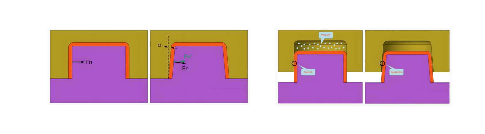
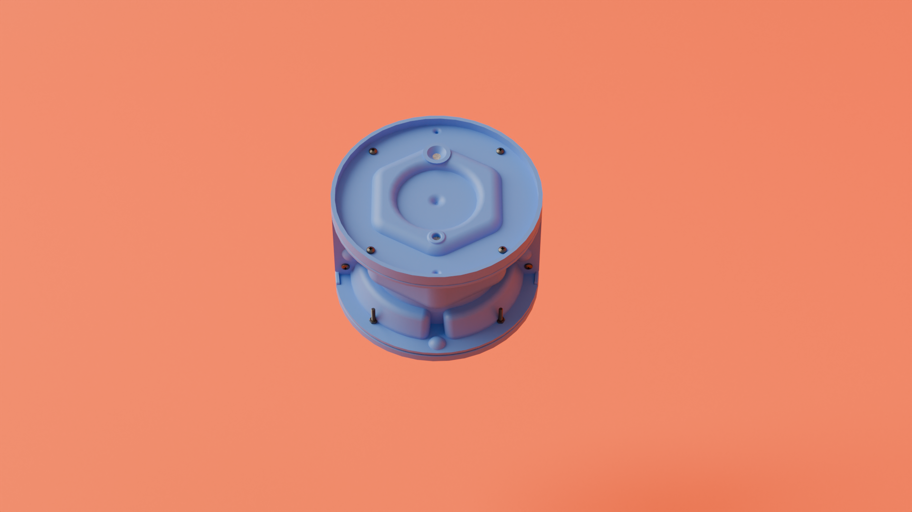
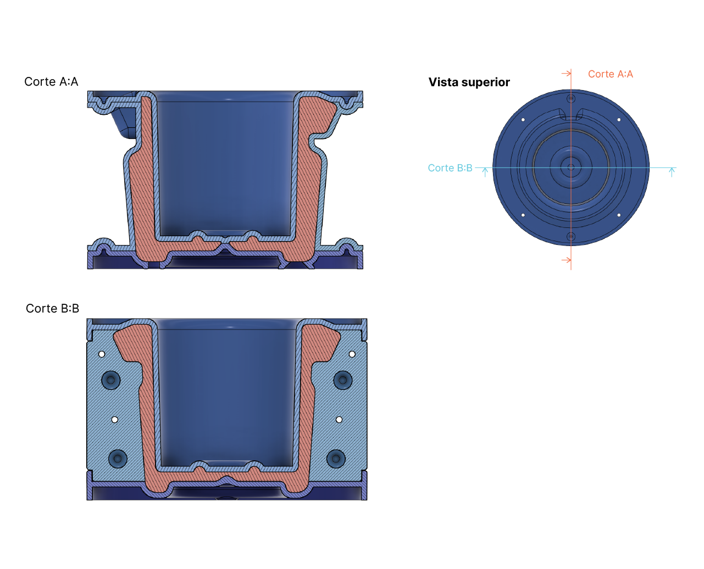

# MT09

## Introducción
El módulo técnico 09 aborda la temática *Moldes*. Estos son utilizados en procesos de moldeado, lo que en términos generales implica el vertido de un material líquido —o al menos en estado plástico, es decir, que al recibir algún tipo de deformación el material adopta esa forma— en una o más piezas que, pudiendo requerir de algún tipo de proceso de secado o solidificación, adopta la forma de la cavidad del molde.

En el marco del MT09, se presenta el desarrollo de una maceta diseñada para su producción mediante moldeado, así como también su correspondiente molde.

## Moldes y moldeado

El moldeado como proceso abarca distintos tipos de materiales y procesos productivos —ya sea inyección, vertido de coladas de cerámica, cera perdida, entre otros— y puede dar como resultado piezas en un amplio rango de complejidades y características técnicas.

Los moldes pueden estar compuestos por una o más piezas que posibilitan, dependiendo de la complejidad de la pieza a desarrollar y de la cantidad de direcciones en que se quiera darle forma.

Por lo general, y en particular en moldes diseñados para el vertido de material, hay algunas consideraciones generales para su desarrollo  que abarcan no solo al molde en sí, sino que también al diseño de la pieza que se desea obtener.

Estas consideraciones son:

**Conicidad de las caras perpendiculares a las paredes:** Para asegurar el desmolde de las piezas se debe evitar que, al ser diseñada para su producción mediante moldes, incorpore paredes rectas que sean paralelas a la dirección en que se retira una parte o la totalidad del molde; para esto se reduce el alguno de la pieza en ese sentido.

*Representación del ángulo de desmolde y comparación con aquella pieza que no la tiene. Fuente: [First Mold](https://firstmold.com/guides/draft-angle/)*

**Desmolde y rebajes:** Para posibilitar el desmolde, la pieza a moldear no debe incorporar rebajes en su volumetría (también conocidos como _undercuts_) que obstruyan la dirección y sentido en que el molde se retira.

**Orificio para ingreso de material líquido y para la salida de aire:** Para que el vertido de la colada de material sea exitoso además de una entrada para este fin, se debe incorporar un orificio que posibilite la salida de aire.

**Elementos de referencia para el armado y posicionado de las piezas del molde:** En el caso de los moldes conformados por más de una pieza, se deben incorporar elementos que sirvan de referencia para su correcto posicionamiento entre sí.

## Actividad
Para la actividad correspondiente al MT09, se propone diseñar una maceta y su correspondiente molde. La pieza debe ser producida a través de un molde de hasta cuatro piezas y sus dimensiones pueden como máximo alcanzar los 150mm de ancho x 100mm de alto.

###  Inspiración y exploración formal
Como referencia para la morfología de la maceta a diseñar, se toma a elementos del trabajo de la [Secesión de Viena](https://secession.at/);  asociación artística austríaca emparentada al Art Noveau fundada en 1897 que tuvo entre sus miembros a Gustav Klimt, Koloman Moser, Josef Hoffmann, Joseph Maria Olbrich, entre otros y que buscaba desarrollar un nuevo lenguaje visual y artístico, una estética y un pensamiento acorde a la época moderna.
A partir de ciertas referencias de su obra, en particular el Pabellón de la Secesión y la tapa de la revista _Ver Sacrum_, llevada adelante por sus integrantes, se exploraron distintas morfologías a nivel de bocetos, que luego fueron llevadas adelante a un modelo 3D mediante el programa Fusion de Autodesk.

*Elementos de inspiración*

###  Resultado final
El producto propuesto es una maceta conformada a través de un molde de cuatro piezas.

Su morfología responde a las referencia visuales anteriormente presentadas, así como las distintas consideraciones necesarias para el desmolde de la pieza final.

A nivel de uso, la maceta incorpora un rebaje a modo de *surco* en la zona superior para permitir que, a través de una cuerda auxiliar, pueda ser colgada de una pared o algún otro elemento. Asimismo, incorpora un orificio en la zona inferior para permitir el desague de la tierra y la planta que contenga, lo que es útil durante el regado e hidratación de la planta.

[Descargar maceta y molde - MT09](<../archivos linkeados/MT09/Pablo Castro - MT09 - EFDI.f3d>){:download="Pablo Castro - MT09.f3d"}

_Vistas del producto_

_Molde cerrado_

_Cortes del molde y la pieza resultante_

###  Proceso de modelado
La definición formal de la maceta y su molde fueron realizadas mediante modelado 3D en el software Fusion. En primer lugar se definió la maceta, para luego, a partir de su volumen, configurar las piezas de su molde. 

La elaboración de la maceta constó de operaciones como _Loft_, _Revolve_, _Draft_, _Fillet_, y _Hole_, así como también extrucciones y operaciones booleanas. En el caso del molde, se opto por envolver el volumen obtenido de la maceta en un cilindro y luego seccionarlo en piezas que permitan su desmolde. Las piezas logradas reciben un vaciado o _Shell_, para de esta forma reducir el material y posibilitar su posicionado y armado una vez impreso en 3D, así como otros ajustes.

<iframe width="560" height="315" src="https://www.youtube.com/embed/xYd2mxFGhTg?si=Dbi-ryCiDcMQEk8W" title="YouTube video player" frameborder="0" allow="accelerometer; autoplay; clipboard-write; encrypted-media; gyroscope; picture-in-picture; web-share" referrerpolicy="strict-origin-when-cross-origin" allowfullscreen></iframe>

###  Conclusiones

Como resultado del MT09 pude profundizar mi conocimiento de la temática de moldes y practicar en el desarrollo de una pieza de relativa complejidad. 

Como posibles aspectos a considerar a nivel de mejora, se entiende que podría a futuro explorarse la posibilidad de incorporar algún patrón a nivel de textura, que responda a los lineamientos visuales presentados como referencia. Asimismo, se podría explorar la posibilidad de rediseñar el mecanismo de sujección de los moldes, para de esa forma poder prescindir de tornillos u otras uniones mecánicas externas.

Personalmente me resultó la experiencia del Módulo Técnico 09 bastante enriquecedora, pues no solo es un área de mi interés, sino que también me resulta relevante en vistas de mi Proyecto Final Integrador.

